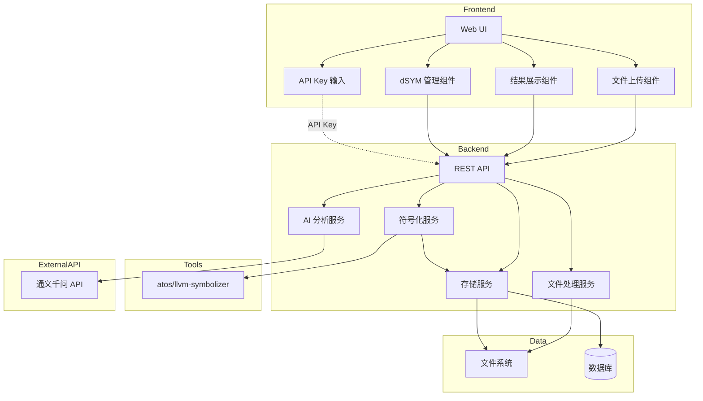
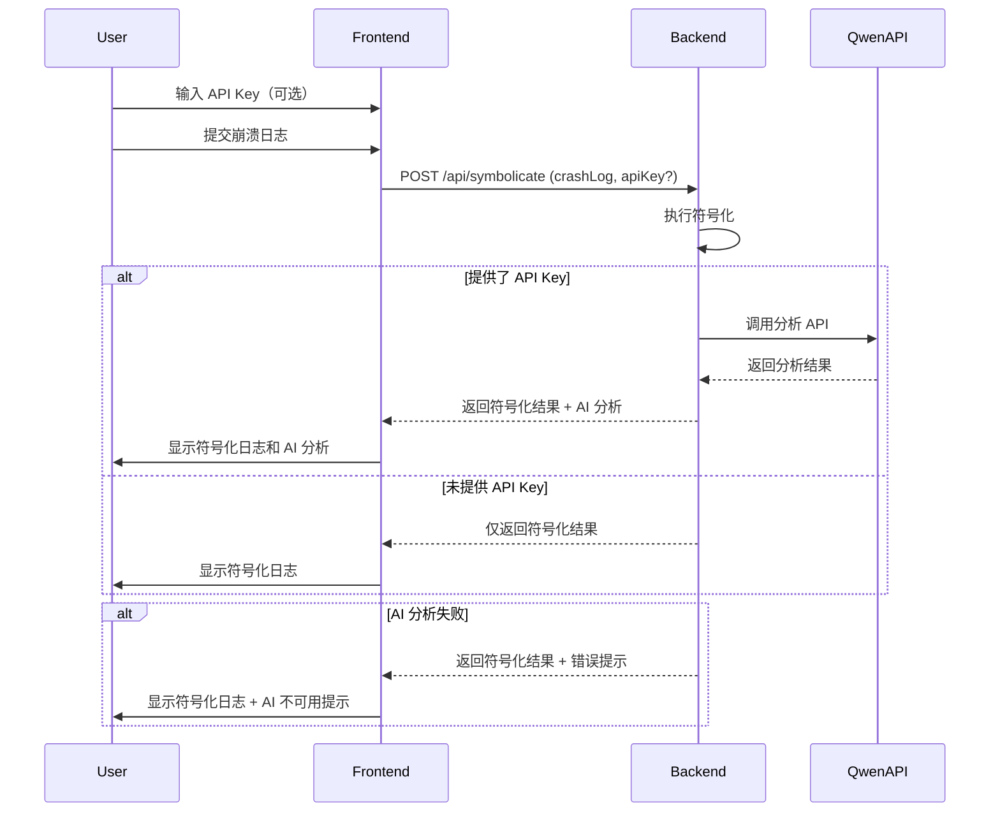

# 设计文档

## 概述

iOS 崩溃日志符号化系统采用前后端分离架构，前端提供用户交互界面，后端处理文件上传、符号化逻辑和数据存储。系统使用 macOS 原生的 `atos` 命令或 `llvm-symbolizer` 工具进行符号化处理。

## 架构

### 系统架构图



### 技术栈选择

**前端:**
- React + TypeScript
- Ant Design (UI 组件库)
- Axios (HTTP 客户端)
- React Router (路由管理)

**后端:**
- Node.js + Express + TypeScript
- Multer (文件上传中间件)
- SQLite (元数据存储)
- child_process (执行符号化命令)

**符号化工具:**
- 优先使用 `atos` (macOS 原生)
- 备选 `llvm-symbolizer` (跨平台)

**AI 服务:**
- 通义千问 API (https://dashscope.aliyuncs.com/compatible-mode/v1)
- 使用 qwen-plus 模型进行崩溃日志分析

## 组件和接口

### 前端组件

#### 1. UploadDSYM 组件
负责 dSYM 文件上传

**Props:**
```typescript
interface UploadDSYMProps {
  onUploadSuccess: (dsymInfo: DSYMInfo) => void;
  onUploadError: (error: string) => void;
}
```

**功能:**
- 支持拖拽上传
- 显示上传进度
- 验证文件类型（.dSYM、.xcarchive、.zip）

#### 2. CrashLogInput 组件
负责崩溃日志输入

**Props:**
```typescript
interface CrashLogInputProps {
  onSubmit: (crashLog: string) => void;
}
```

**功能:**
- 文本框粘贴输入
- 文件上传输入
- 格式预览

#### 3. SymbolicatedResult 组件
显示符号化结果

**Props:**
```typescript
interface SymbolicatedResultProps {
  originalLog: string;
  symbolicatedLog: string;
  onDownload: () => void;
}
```

**功能:**
- 对比显示原始和符号化日志
- 高亮符号化行
- 下载功能

#### 4. DSYMManager 组件
管理 dSYM 文件

**Props:**
```typescript
interface DSYMManagerProps {
  dsyms: DSYMInfo[];
  onDelete: (uuid: string) => void;
  onRefresh: () => void;
}
```

**功能:**
- 列表展示
- 搜索过滤
- 删除操作

#### 5. AIAnalysisPanel 组件
显示 AI 分析结果

**Props:**
```typescript
interface AIAnalysisPanelProps {
  analysis: CrashAnalysis | null;
  loading: boolean;
}
```

**功能:**
- 显示崩溃类型和严重程度
- 显示可能原因列表
- 显示修复建议列表
- 显示受影响组件
- 显示 AI 总结
- 使用图标和颜色区分严重程度

#### 6. APIKeyInput 组件
API Key 输入组件

**Props:**
```typescript
interface APIKeyInputProps {
  value: string;
  onChange: (key: string) => void;
  onValidate?: (isValid: boolean) => void;
}
```

**功能:**
- 密码输入框（隐藏显示）
- 实时验证格式
- 临时存储（仅会话期间）
- 清除按钮

### 后端 API 接口

#### 1. POST /api/dsym/upload
上传 dSYM 文件

**Request:**
- Content-Type: multipart/form-data
- Body: file (dSYM 文件)

**Response:**
```typescript
{
  success: boolean;
  data?: {
    uuid: string;
    appName: string;
    version: string;
    uploadTime: string;
  };
  error?: string;
}
```

#### 2. POST /api/symbolicate
符号化崩溃日志

**Request:**
```typescript
{
  crashLog: string;
  uuid?: string; // 可选，如果不提供则自动提取
  apiKey?: string; // 可选，通义千问 API Key
}
```

**Response:**
```typescript
{
  success: boolean;
  data?: {
    originalLog: string;
    symbolicatedLog: string;
    matchedUUID: string;
    analysis?: CrashAnalysis; // AI 分析结果（如果提供了 API Key）
  };
  error?: string;
}
```

#### 3. GET /api/dsym/list
获取 dSYM 列表

**Response:**
```typescript
{
  success: boolean;
  data?: DSYMInfo[];
  error?: string;
}
```

#### 4. DELETE /api/dsym/:uuid
删除 dSYM 文件

**Response:**
```typescript
{
  success: boolean;
  error?: string;
}
```

## 数据模型

### DSYMInfo 表

```sql
CREATE TABLE dsym_info (
  id INTEGER PRIMARY KEY AUTOINCREMENT,
  uuid TEXT UNIQUE NOT NULL,
  app_name TEXT NOT NULL,
  version TEXT NOT NULL,
  build_number TEXT,
  architecture TEXT NOT NULL,
  file_path TEXT NOT NULL,
  file_size INTEGER NOT NULL,
  upload_time DATETIME DEFAULT CURRENT_TIMESTAMP,
  INDEX idx_uuid (uuid)
);
```

### TypeScript 类型定义

```typescript
interface DSYMInfo {
  id: number;
  uuid: string;
  appName: string;
  version: string;
  buildNumber?: string;
  architecture: string;
  filePath: string;
  fileSize: number;
  uploadTime: string;
}

interface CrashLog {
  content: string;
  uuid?: string;
  format: 'apple' | 'ips' | 'unknown';
}

interface SymbolicationResult {
  originalLog: string;
  symbolicatedLog: string;
  matchedUUID: string;
  success: boolean;
  analysis?: CrashAnalysis;
}

interface CrashAnalysis {
  summary: string;
  crashType: string;
  possibleCauses: string[];
  suggestions: string[];
  severity: 'low' | 'medium' | 'high' | 'critical';
  affectedComponents: string[];
}
```

## 核心服务设计

### FileHandlerService

负责文件处理和解压

**方法:**
```typescript
class FileHandlerService {
  // 处理上传的文件
  async processUploadedFile(file: Express.Multer.File): Promise<string>;
  
  // 解压 zip 文件
  async extractZip(zipPath: string): Promise<string>;
  
  // 从 xcarchive 中提取 dSYM
  async extractFromXCArchive(archivePath: string): Promise<string[]>;
  
  // 提取 UUID
  async extractUUID(dsymPath: string): Promise<string>;
  
  // 验证 dSYM 文件
  async validateDSYM(dsymPath: string): Promise<boolean>;
}
```

**实现细节:**
- 使用 `dwarfdump --uuid` 命令提取 UUID
- 使用 `unzip` 或 `adm-zip` 库解压文件
- 临时文件存储在 `/tmp/uploads`
- 验证后移动到永久存储目录

### SymbolizerService

负责符号化逻辑

**方法:**
```typescript
class SymbolizerService {
  // 符号化崩溃日志
  async symbolicate(crashLog: string, dsymPath: string): Promise<string>;
  
  // 解析崩溃日志格式
  parseCrashLog(content: string): CrashLog;
  
  // 提取堆栈地址
  extractStackAddresses(crashLog: string): StackFrame[];
  
  // 使用 atos 符号化
  async symbolicateWithAtos(
    addresses: string[],
    dsymPath: string,
    loadAddress: string
  ): Promise<Map<string, string>>;
}
```

**实现细节:**
- 使用正则表达式解析崩溃日志
- 提取二进制名称、加载地址、堆栈地址
- 调用 `atos -o <dSYM> -l <loadAddress> <address>` 进行符号化
- 替换原始日志中的地址为符号信息

**atos 命令示例:**
```bash
atos -o MyApp.app.dSYM/Contents/Resources/DWARF/MyApp \
     -l 0x100000000 \
     0x100001234 0x100002345
```

### StorageService

负责数据存储和查询

**方法:**
```typescript
class StorageService {
  // 保存 dSYM 信息
  async saveDSYMInfo(info: DSYMInfo): Promise<void>;
  
  // 根据 UUID 查找 dSYM
  async findByUUID(uuid: string): Promise<DSYMInfo | null>;
  
  // 获取所有 dSYM
  async getAllDSYMs(): Promise<DSYMInfo[]>;
  
  // 删除 dSYM
  async deleteDSYM(uuid: string): Promise<void>;
}
```

**存储结构:**
```
storage/
├── dsyms/
│   ├── <uuid1>/
│   │   └── MyApp.app.dSYM/
│   ├── <uuid2>/
│   │   └── MyApp.app.dSYM/
└── database.sqlite
```

### QwenAIService

负责通义千问 AI 分析

**方法:**
```typescript
class QwenAIService {
  // 分析符号化后的崩溃日志
  async analyzeCrashLog(
    symbolicatedLog: string,
    apiKey: string
  ): Promise<CrashAnalysis>;
  
  // 构建分析提示词
  private buildAnalysisPrompt(symbolicatedLog: string): string;
  
  // 解析 AI 响应
  private parseAIResponse(response: string): CrashAnalysis;
  
  // 验证 API Key
  async validateAPIKey(apiKey: string): Promise<boolean>;
}
```

**实现细节:**
- 使用通义千问 OpenAI 兼容接口
- API 端点：`https://dashscope.aliyuncs.com/compatible-mode/v1/chat/completions`
- 模型：`qwen-plus`
- 超时设置：30 秒
- 不存储 API Key，仅在请求中使用
- 构建专业的提示词，引导 AI 分析崩溃日志
- 解析 AI 返回的 JSON 格式分析结果

**API 请求示例:**
```typescript
{
  model: "qwen-plus",
  messages: [
    {
      role: "system",
      content: "你是一个 iOS 崩溃日志分析专家..."
    },
    {
      role: "user",
      content: "请分析以下符号化后的崩溃日志：\n\n{symbolicatedLog}"
    }
  ],
  temperature: 0.7,
  max_tokens: 2000
}
```

**提示词设计:**
系统提示词应包含：
- 角色定位：iOS 崩溃日志分析专家
- 分析要求：识别崩溃类型、分析原因、提供建议
- 输出格式：JSON 格式，包含 summary、crashType、possibleCauses、suggestions、severity、affectedComponents
- 分析重点：关注堆栈信息、异常类型、线程状态等

**响应解析:**
- 提取 JSON 格式的分析结果
- 验证必需字段
- 设置默认值处理缺失字段
- 错误处理和降级策略

## 错误处理

### 错误类型定义

```typescript
enum ErrorCode {
  INVALID_FILE_FORMAT = 'INVALID_FILE_FORMAT',
  UUID_NOT_FOUND = 'UUID_NOT_FOUND',
  DSYM_NOT_FOUND = 'DSYM_NOT_FOUND',
  SYMBOLICATION_FAILED = 'SYMBOLICATION_FAILED',
  FILE_TOO_LARGE = 'FILE_TOO_LARGE',
  INVALID_CRASH_LOG = 'INVALID_CRASH_LOG',
  AI_ANALYSIS_FAILED = 'AI_ANALYSIS_FAILED',
  INVALID_API_KEY = 'INVALID_API_KEY',
  AI_API_TIMEOUT = 'AI_API_TIMEOUT',
}

class AppError extends Error {
  constructor(
    public code: ErrorCode,
    public message: string,
    public statusCode: number = 400
  ) {
    super(message);
  }
}
```

### 错误处理策略

1. **文件上传错误:**
   - 文件大小限制：500MB
   - 格式验证失败：返回 400 错误
   - 存储空间不足：返回 507 错误

2. **符号化错误:**
   - UUID 不匹配：提示用户上传对应的 dSYM
   - atos 命令失败：记录日志并返回原始日志
   - 超时处理：30 秒超时限制

3. **数据库错误:**
   - 连接失败：重试 3 次
   - 唯一性冲突：提示 dSYM 已存在

4. **AI 分析错误:**
   - API Key 无效：返回 401 错误，提示检查 API Key
   - API 调用失败：记录日志，返回符号化结果但不包含分析
   - 超时处理：30 秒超时，提示用户稍后重试
   - 响应解析失败：使用默认分析结果或提示分析不可用
   - 网络错误：提示网络连接问题

### 日志记录

使用 Winston 进行日志记录：

```typescript
const logger = winston.createLogger({
  level: 'info',
  format: winston.format.json(),
  transports: [
    new winston.transports.File({ filename: 'error.log', level: 'error' }),
    new winston.transports.File({ filename: 'combined.log' }),
  ],
});
```

## 测试策略

### 单元测试

**测试工具:** Jest + Supertest

**测试覆盖:**
1. FileHandlerService
   - UUID 提取测试
   - 文件格式验证测试
   - 解压功能测试

2. SymbolizerService
   - 崩溃日志解析测试
   - 地址提取测试
   - atos 命令执行测试（mock）

3. StorageService
   - CRUD 操作测试
   - UUID 查询测试

4. QwenAIService
   - 提示词构建测试
   - API 调用测试（mock）
   - 响应解析测试
   - 错误处理测试

### 集成测试

1. 完整的上传-符号化流程测试
2. API 端点测试
3. 错误场景测试

### 测试数据

准备测试用例：
- 示例 dSYM 文件
- 各种格式的崩溃日志样本
- 边界情况数据

## 性能考虑

### 优化策略

1. **文件处理:**
   - 使用流式处理大文件
   - 异步解压和处理
   - 临时文件及时清理

2. **符号化性能:**
   - 批量处理地址（一次 atos 调用处理多个地址）
   - 缓存符号化结果
   - 限制并发符号化任务数量

3. **数据库查询:**
   - UUID 字段建立索引
   - 使用连接池

4. **前端优化:**
   - 大文件分片上传
   - 虚拟滚动显示长日志
   - 结果懒加载

5. **AI 分析优化:**
   - 仅在用户提供 API Key 时调用
   - 异步执行，不阻塞符号化结果展示
   - 失败时优雅降级，不影响核心功能
   - 前端缓存当前会话的分析结果

### 资源限制

- 单个文件上传限制：500MB
- 并发符号化任务：最多 5 个
- 符号化超时：30 秒
- 数据库连接池：10 个连接
- AI 分析超时：30 秒
- AI 分析并发：最多 3 个

## 安全考虑

1. **文件上传安全:**
   - 验证文件类型和扩展名
   - 限制文件大小
   - 隔离存储用户上传的文件

2. **命令注入防护:**
   - 严格验证传递给 atos 的参数
   - 使用参数化命令执行

3. **路径遍历防护:**
   - 验证文件路径
   - 使用 path.resolve 规范化路径

4. **访问控制:**
   - 后续可添加用户认证
   - dSYM 文件隔离存储

5. **API Key 安全:**
   - 不在后端存储 API Key
   - 不记录 API Key 到日志
   - 使用 HTTPS 传输
   - 前端仅在内存中保存（会话期间）
   - 页面刷新后需要重新输入

## 部署架构

### 开发环境

```
npm run dev (前端)
npm run server (后端)
```

### 生产环境

**要求:**
- macOS 系统（用于 atos 命令）
- Node.js 18+
- 足够的磁盘空间（建议 100GB+）

**部署方式:**
- 使用 PM2 管理 Node.js 进程
- Nginx 反向代理
- 前端静态文件部署到 CDN（可选）

**环境变量:**
```
PORT=3000
UPLOAD_DIR=/var/app/storage/uploads
DSYM_DIR=/var/app/storage/dsyms
DB_PATH=/var/app/storage/database.sqlite
MAX_FILE_SIZE=524288000
LOG_LEVEL=info
QWEN_API_ENDPOINT=https://dashscope.aliyuncs.com/compatible-mode/v1
QWEN_MODEL=qwen-plus
AI_ANALYSIS_TIMEOUT=30000
```

## AI 分析工作流程

### 用户交互流程



### 前端状态管理

```typescript
interface SymbolicatePageState {
  apiKey: string; // 仅在内存中保存
  crashLog: string;
  isSymbolicating: boolean;
  isAnalyzing: boolean;
  result: SymbolicationResult | null;
  error: string | null;
}
```

**状态流转:**
1. 用户输入 API Key（可选）→ 保存到组件状态
2. 用户提交崩溃日志 → 设置 isSymbolicating = true
3. 符号化完成 → 设置 isSymbolicating = false，isAnalyzing = true（如果有 API Key）
4. AI 分析完成 → 设置 isAnalyzing = false，显示结果
5. 页面刷新或离开 → 清空所有状态（包括 API Key）

### 错误处理和降级策略

1. **API Key 验证失败:**
   - 前端提示：API Key 无效，请检查
   - 不影响符号化功能
   - 用户可以重新输入

2. **AI 分析超时:**
   - 显示符号化结果
   - 提示：AI 分析超时，请稍后重试
   - 提供重新分析按钮

3. **AI API 调用失败:**
   - 显示符号化结果
   - 提示：AI 分析暂时不可用
   - 记录错误日志供排查

4. **响应格式错误:**
   - 显示符号化结果
   - 提示：AI 分析结果解析失败
   - 使用默认的空分析结果
