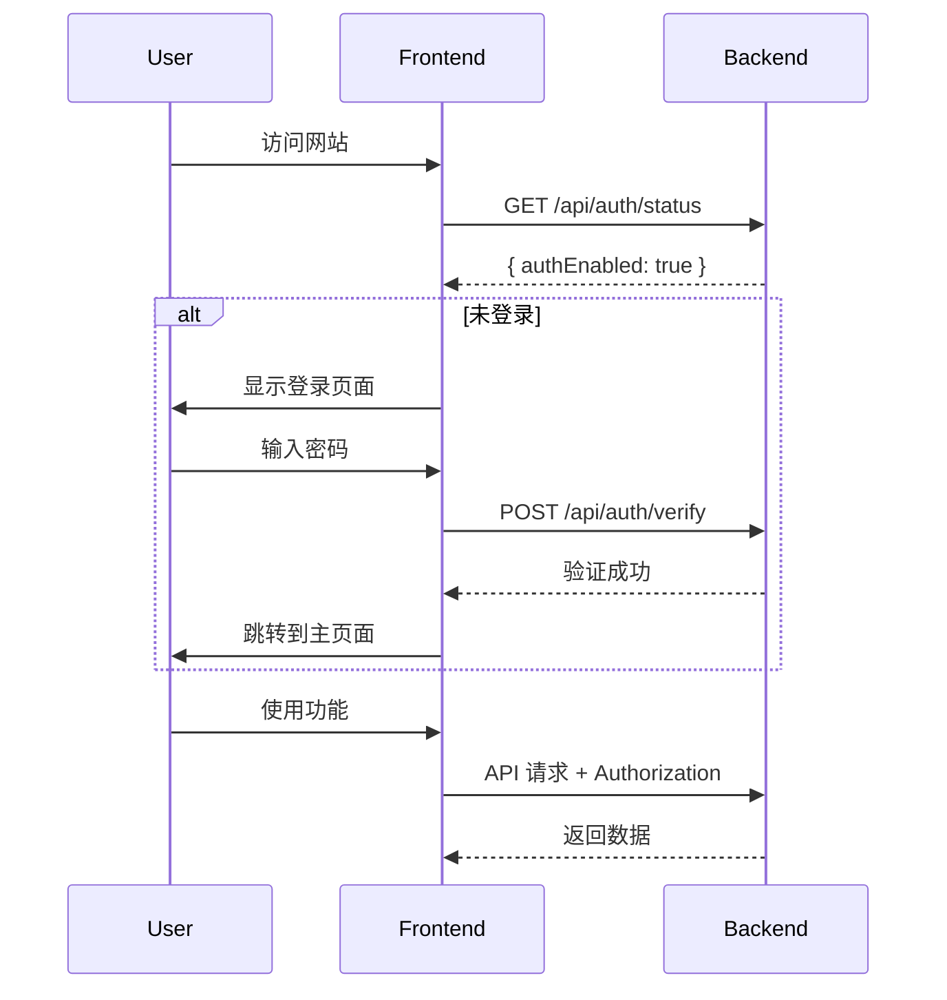

# 网站权限认证设置指南

## 功能概述

系统已集成简单的密码认证功能，可以保护整个网站免受未授权访问。

## 特性

- ✅ 简单密码保护
- ✅ 会话管理（基于 sessionStorage）
- ✅ 自动拦截未授权请求
- ✅ 优雅的登录界面
- ✅ 可选启用/禁用
- ✅ 环境变量配置

## 配置方法

### 1. 启用认证

编辑 `backend/.env` 文件：

```env
# 网站权限认证配置
AUTH_ENABLED=true
AUTH_PASSWORD=your_secure_password_here
```

**参数说明：**
- `AUTH_ENABLED`: 是否启用认证（`true` 或 `false`）
- `AUTH_PASSWORD`: 访问密码（请设置一个安全的密码）

### 2. 禁用认证

如果不需要认证功能，设置：

```env
AUTH_ENABLED=false
```

或者直接删除这两行配置。

### 3. 重启服务

修改配置后，需要重启后端服务：

```bash
# 停止当前服务（Ctrl+C）
# 重新启动
npm run dev:backend
```

## 使用方法

### 启用认证后

1. 访问网站时会自动跳转到登录页面
2. 输入配置的密码
3. 点击"登录"按钮
4. 登录成功后可以正常使用所有功能

### 会话管理

- 登录状态保存在浏览器的 sessionStorage 中
- 关闭浏览器标签页后需要重新登录
- 刷新页面不需要重新登录

### 自动登出

- 如果密码被修改，已登录用户会自动登出
- API 返回 401 错误时会自动跳转到登录页面

## 安全建议

### 1. 设置强密码

建议使用包含大小写字母、数字和特殊字符的强密码：

```env
AUTH_PASSWORD=MySecure@Password123!
```

### 2. 使用 HTTPS

在生产环境中，务必使用 HTTPS 协议，避免密码在传输过程中被窃取。

### 3. 定期更换密码

建议定期更换访问密码，提高安全性。

### 4. 限制访问 IP

如果可能，在服务器层面（如 Nginx）配置 IP 白名单，进一步提高安全性。

## 技术实现

### 后端

**认证中间件** (`backend/src/middleware/auth.ts`):
- 检查请求头中的 Authorization 字段
- 验证密码是否正确
- 未授权请求返回 401 错误

**认证路由** (`backend/src/routes/auth.routes.ts`):
- `POST /api/auth/verify` - 验证密码
- `GET /api/auth/status` - 检查认证状态

### 前端

**登录页面** (`frontend/src/pages/LoginPage.tsx`):
- 优雅的登录界面
- 密码输入框
- 支持回车键登录

**认证工具** (`frontend/src/utils/auth.ts`):
- Token 管理（sessionStorage）
- 认证状态检查
- 自动添加认证头

**API 拦截器** (`frontend/src/services/api.ts`):
- 自动添加 Authorization 头
- 401 错误自动登出

## 工作流程



## 常见问题

### Q: 忘记密码怎么办？

A: 直接修改 `backend/.env` 文件中的 `AUTH_PASSWORD`，然后重启服务。

### Q: 如何让多个用户使用不同密码？

A: 当前版本只支持单一密码。如需多用户支持，需要实现完整的用户管理系统。

### Q: 密码会被保存在哪里？

A: 密码保存在服务器的环境变量中（`.env` 文件），不会存储在数据库中。前端使用 sessionStorage 保存认证令牌。

### Q: 认证是否安全？

A: 这是一个简单的密码保护方案，适合内部工具使用。对于高安全要求的场景，建议：
- 使用 HTTPS
- 实现完整的用户认证系统
- 使用 JWT 或 OAuth
- 添加 IP 白名单

### Q: 如何在生产环境中使用？

A: 
1. 设置强密码
2. 启用 HTTPS
3. 配置防火墙规则
4. 定期更换密码
5. 监控访问日志

## 升级建议

如果需要更完善的权限系统，可以考虑：

1. **多用户支持**
   - 用户注册和管理
   - 不同用户不同权限
   - 用户角色管理

2. **JWT 认证**
   - 更安全的令牌机制
   - 令牌过期管理
   - 刷新令牌

3. **OAuth 集成**
   - 支持第三方登录
   - 企业 SSO 集成

4. **审计日志**
   - 记录所有登录尝试
   - 记录用户操作
   - 异常行为检测

## 示例配置

### 开发环境

```env
# 开发环境可以禁用认证
AUTH_ENABLED=false
```

### 测试环境

```env
# 测试环境使用简单密码
AUTH_ENABLED=true
AUTH_PASSWORD=test123
```

### 生产环境

```env
# 生产环境使用强密码
AUTH_ENABLED=true
AUTH_PASSWORD=Pr0d@SecureP@ssw0rd!2024
```

## 总结

网站权限认证功能已成功集成，可以通过简单的配置启用或禁用。这是一个轻量级的解决方案，适合内部工具和小型团队使用。

如有任何问题或需要更高级的功能，请参考本文档或联系开发团队。
