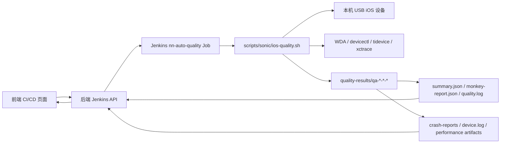

# iOS 自动质检整体架构与功能说明

本文档整理 `nn-ios-platform` 当前自动质检能力，重点说明 Jenkins 自动质检任务、iOS 真机执行链路、设备池、多任务并行、Monkey 业务感知探索、卡顿检测、报告产物与后续优化方向。

## 目标定位

自动质检平台用于把构建产物和真实 iOS 设备连接起来，在发布前自动完成基础稳定性、业务探索、卡顿检测、崩溃与现场证据采集。

当前重点目标：

- 支持从构建列表直接发起质检任务。
- 支持本机 USB iOS 真机、多设备池、多任务并行。
- 支持 Pgyer 包安装测试，以及 TestFlight/App Store 已安装包测试。
- 支持 Monkey 从随机点击升级为 nnios 业务感知探索。
- 支持独立卡顿检测套件，避免与 Monkey 报告混杂。
- 支持任务状态、设备占用、报告产物、崩溃文件、日志和性能证据闭环展示。

## 总体架构



核心职责：

- 前端：发起质检、选择测试套件、选择设备池和设备、展示任务列表与报告。
- 后端：聚合构建信息，选择可用设备，拼装 Jenkins 参数，查询 Jenkins 与本地报告，修正状态不一致。
- Jenkins：承载 `nn-auto-quality` 任务，调度执行脚本并归档产物。
- 执行脚本：安装/启动 App，启动或复用 WDA，执行测试套件，采集日志/崩溃/性能/报告。
- 设备池：管理 USB 真机和 WDA 端口，保证并发任务不抢同一台设备。

## 关键代码入口

| 模块 | 文件 | 作用 |
| --- | --- | --- |
| 前端页面 | `frontend/src/pages/CICDPage.tsx` | 构建列表、质检任务列表、发起质检弹窗、报告详情 |
| Jenkins 路由 | `backend/src/routes/jenkins.routes.ts` | 传统平台入口，触发 Jenkins 质检、查询任务、设备池管理、报告预览 |
| 质量服务路由 | `backend/src/routes/quality.routes.ts` | 标准化质量任务接口、历史任务查询、本地 artifact 读取 |
| 执行脚本 | `scripts/sonic/ios-quality.sh` | iOS 本机真机自动质检主执行器 |
| 业务映射 | `config/nnios-business-map.json` | nnios ViewController 与业务域映射、业务入口轮转配置 |
| Skill | `~/.codex/skills/ai-ios-monkey-testing` | nnios Monkey 测试策略、分析模板和执行规范 |

## 任务发起流程

1. 用户在 CI/CD 页面选择来源构建。
2. 选择测试套件：
   - Monkey 测试。
   - 卡顿检测。
   - 其他基础套件。
3. 选择发布渠道和安装模式：
   - Pgyer/开发包：下载或定位 IPA/xcarchive 后安装到设备，默认 Bundle ID 为 `com.nndev.im`。
   - TestFlight/App Store：跳过安装，测试手机上已安装的线上包，Bundle ID 为 `com.nnhuyu.im`。
4. 选择设备池和空闲设备。
5. 后端校验设备是否空闲，并生成独立 WDA URL/DerivedData 路径。
6. 后端调用 Jenkins `nn-auto-quality` 的 `buildWithParameters`。
7. Jenkins 执行 `scripts/sonic/ios-quality.sh`。
8. 前端通过任务列表和本地 `quality-progress.json` 持续刷新状态。

## Jenkins 参数模型

主要参数分组：

| 分组 | 参数示例 | 说明 |
| --- | --- | --- |
| 来源构建 | `SOURCE_JOB`, `SOURCE_BUILD_NUMBER`, `BRANCH`, `COMMIT_HASH`, `APP_VERSION` | 关联被测构建 |
| 包信息 | `PACKAGE_URL`, `XCARCHIVE_PATH`, `ARCHIVE_URL`, `APP_BUNDLE_ID`, `SKIP_APP_INSTALL` | 决定安装或跳过安装 |
| 测试套件 | `TEST_SUITE`, `REQUESTED_TEST_SUITE`, `RUN_MONKEY`, `STUTTER_SCENARIO` | 决定执行 Monkey、卡顿或其他套件 |
| 设备池 | `DEVICE_POOL`, `DEVICE_POOL_LABEL`, `DEVICE_UDID`, `DEVICE_SELECTOR` | 设备选择与占用 |
| WDA | `WDA_URL`, `WDA_AUTO_START`, `WDA_DERIVED_DATA_PATH`, `WDA_PROJECT_PATH` | UI 自动化通道 |
| Monkey | `MONKEY_DURATION_SECONDS`, `MONKEY_INTERVAL_SECONDS`, `MONKEY_STUCK_EVENTS` | Monkey 运行策略 |
| 业务感知 | `MONKEY_BUSINESS_AWARE`, `MONKEY_BUSINESS_MAP_PATH`, `MONKEY_BUSINESS_DOMAINS`, `MONKEY_BUSINESS_NAV_INTERVAL_EVENTS` | 业务探索策略 |
| 性能采样 | `PERFORMANCE_SAMPLING`, `PERFORMANCE_SAMPLER`, `PERFORMANCE_XCTRACE_TEMPLATE` | CPU/内存/Trace/卡顿数据 |

## 设备池与并发

设备池配置保存在平台数据目录中：

- 新配置：`nn-ios-platform-data/quality-device-pools.json`
- 兼容旧配置：`nn-ios-platform-data/sonic-device-pools.json`

并发规则：

- 一个任务只能占用一个 UDID。
- 多个任务可以同时运行，但必须分配到不同 UDID。
- WDA URL 按设备池和设备生成，避免端口冲突。
- WDA DerivedData 按设备隔离，避免多设备编译缓存互相影响。
- 设备占用状态来自 Jenkins 运行任务和本地 `quality-progress.json`/`summary.json` 双重判断。
- 如果 Jenkins 记录未及时结束，但本地报告已经生成，后端会按本地报告对任务状态做纠偏。

## 测试套件职责

### Monkey 测试

定位：稳定性探索和业务路径覆盖。

关注：

- 安装、启动、基础可用性。
- 随机与业务感知结合的页面探索。
- 崩溃、异常、App 离开前台、WDA 中断、页面停留不变。
- 最后动作、业务路径、设备日志、崩溃文件。

不作为 Monkey 结论的指标：

- FPS 平均值。
- 帧级卡顿。
- Animation Hitches。
- Time Profiler 调用栈。

这些指标应由卡顿检测套件负责。

### 卡顿检测

定位：场景化卡顿和响应延迟分析。

关注：

- 自动进入指定业务场景。
- 场景动作耗时。
- xctrace Trace。
- Animation Hitches 或 Time Profiler 相关证据。
- 卡顿样本、可能调用栈、现场证据。

当前场景包括：

- 社区。
- IM。
- 语音房。
- 其他后续可扩展业务链路。

## nnios 业务感知 Monkey

业务感知 Monkey 由两部分组成：

1. 页面识别：根据 WDA source、ViewController 类名、可见文本、关键字规则推断业务域。
2. 行为选择：根据业务域、风险等级和覆盖情况选择下一步动作。

业务域：

- `login`：登录/session。
- `im`：消息、聊天、好友、联系人。
- `community`：社区、关注、搜索、帖子/频道。
- `voice_room`：语音房、频道、上麦、房间生命周期。
- `profile`：我的、个人中心、设置。
- `playwith`：订单、钱包、充值等只读探索。

关键配置：

- `config/nnios-business-map.json`
  - `classes`：ViewController 到业务域/路径映射。
  - `keywordRules`：类名不可见时的关键字兜底识别。
  - `guardedKeywords`：高风险关键词，只读保护。
  - `blockedKeywords`：禁止继续点击的页面关键词。
  - `businessNavigation`：主入口轮转配置。

当前业务入口轮转策略：

- 默认每 8 次 Monkey 动作触发一次业务入口检查。
- 优先选择覆盖次数较少的业务域。
- 优先点击 WDA source 中识别到的入口文案坐标。
- 如果找不到文案坐标，使用底部 Tab 区域兜底坐标。
- 重点保证消息、我的、社区、语音房都被覆盖，避免长时间停留在单一模块。

## 风险保护策略

风险等级：

| 等级 | 行为 |
| --- | --- |
| `normal` | 正常探索 |
| `high` | 可探索，但应增加返回和恢复动作 |
| `guarded` | 只读探索，不随机点击危险按钮 |
| `blocked` | 退出页面或只保留证据 |

保护目标：

- 不触发支付、充值、退款、真实购买。
- 不触发退出登录、注销账号、删除数据。
- 不触发举报、拉黑、封禁、社区管理提交。
- 避免进入调试面板、日志面板、DoKit/FLEX 等非业务页面。

## 执行器阶段

`scripts/sonic/ios-quality.sh` 的主流程：

1. 初始化任务目录和日志。
2. 写入 `quality-progress.json`，让前端尽早看到任务状态。
3. 检测 USB 设备。
4. 根据包类型安装 IPA，或跳过安装直接启动线上包。
5. 启动 App，并做冷启动稳定等待。
6. 根据套件启动性能采样或 xctrace。
7. 启动或检查 WDA。
8. 执行 Monkey 或卡顿检测。
9. 采集设备日志。
10. 采集当前质检窗口内的崩溃/异常文件。
11. 生成 `summary.json`、`result.json`、`issues.json`、`report.html` 等标准产物。
12. 清理会影响设备状态的资源，结束任务。

## 报告与产物

每次任务的结果目录：

```text
~/.jenkins/workspace/nn-auto-quality/quality-results/qa-<qualityBuild>-<sourceBuild>-<suite>/
```

主要产物：

| 文件 | 说明 |
| --- | --- |
| `summary.json` | 平台报告核心汇总 |
| `quality-progress.json` | 任务运行中进度 |
| `quality.log` | 质检执行日志 |
| `monkey-report.json` | Monkey 或卡顿动作报告 |
| `device.log` | 设备日志 |
| `crash-reports/` | 本次任务窗口内采集到的崩溃/异常文件 |
| `performance-samples.jsonl` | CPU/内存等采样数据 |
| `performance.trace.zip` | xctrace 原始 Trace 压缩包 |
| `performance-stutters.json` | 卡顿检测帧级结果 |
| `performance-stack-analysis.json` | 卡顿调用栈分析结果 |
| `result.json` | 标准化任务结果 |
| `issues.json` | 标准化问题列表 |
| `report.html` | Jenkins 可归档 HTML 报告 |
| `junit.xml` | Jenkins 测试结果入口 |

## 报告展示原则

Monkey 报告优先展示：

- 执行状态。
- 执行动作数和计划时长。
- 业务探索覆盖。
- 崩溃与异常分析。
- 质检日志。
- 现场证据。
- 基础 CPU/内存观察。

Monkey 报告不展示或不重点展示：

- FPS。
- 帧级卡顿。
- 卡顿调用栈。
- 过多无意义的过程表格。

卡顿报告优先展示：

- 卡顿结论。
- 场景、动作耗时和卡顿样本。
- Trace 下载。
- xctrace 分析图。
- 卡顿调用栈。
- 可复现业务路径。

## 状态一致性设计

前端列表可能同时看到 Jenkins 状态和本地报告状态，因此后端做了本地纠偏：

- 如果 Jenkins 仍显示 running，但本地 `summary.json` 已生成，则按本地报告纠偏为完成。
- 如果 Jenkins 已结束，但设备仍显示占用，则通过活跃任务和进度文件判断是否释放。
- 如果 Jenkins 构建记录未归档平台报告，后端会从本地 workspace 的 `quality-results` 查找。
- 如果质检进程已退出但 Jenkins 未收尾，则按中断状态处理。

## TestFlight 与 App Store 测试

线上包和 TestFlight 包不由平台安装：

- 用户先通过 TestFlight/App Store 在手机上安装 App。
- 平台发起质检时设置 `SKIP_APP_INSTALL=1`。
- Bundle ID 使用 `com.nnhuyu.im`。
- 执行器直接启动已安装 App 并进入测试。

Pgyer/开发包：

- 平台从构建产物定位 IPA 或 xcarchive。
- 安装到设备。
- Bundle ID 使用 `com.nndev.im`。

## 当前能力清单

- 构建列表发起自动质检。
- Jenkins Job 配置同步。
- 多设备池配置。
- 设备空闲/占用状态展示。
- 多任务并行，按 UDID 隔离。
- Monkey 测试。
- 业务感知 Monkey。
- Monkey 业务入口轮转。
- 卡顿检测套件。
- TestFlight/App Store 已安装包测试。
- Pgyer/开发包安装测试。
- WDA 自动启动与恢复。
- 设备日志采集。
- 崩溃/IPS 文件采集与下载。
- 本次质检窗口内崩溃文件筛选。
- 基础性能采样。
- xctrace Trace 采集与下载。
- Jenkins 状态与本地报告状态纠偏。
- 平台报告文件预览和下载。

## 已知边界

- WDA 依赖 USB、设备解锁、开发者模式和签名稳定性，长时间 Monkey 仍可能遇到 WDA 中断。
- Monkey 是稳定性探索，不适合承担精确卡顿结论。
- xctrace 导出 CPU/FPS/调用栈依赖模板、iOS 版本、Xcode 能力和 Trace 内容。
- TestFlight/App Store 包需要用户预先在设备上安装并保持账号状态可用。
- 业务感知依赖可见文本、WDA source 和类名/关键字映射，覆盖质量需要持续维护 `nnios-business-map.json`。

## 后续建议

- 持续补充 ViewController 与业务路径映射，尤其 IM、我的、登录异常态、语音房复杂弹窗。
- 为业务入口轮转增加报告覆盖阈值，例如短任务至少触达 `im/profile/community/voice_room` 各一次。
- 将稳定复现的 Monkey 失败路径沉淀为确定性业务回归用例。
- 将卡顿检测继续独立发展，避免 Monkey 报告再次混入 FPS/卡顿指标。
- 将 WDA 清理入口更多放在设备池维度，避免误操作影响正在运行的质检设备。
- 增加质检任务结束后的资源回收审计，包括 WDA、iproxy、xctrace、设备占用状态。

