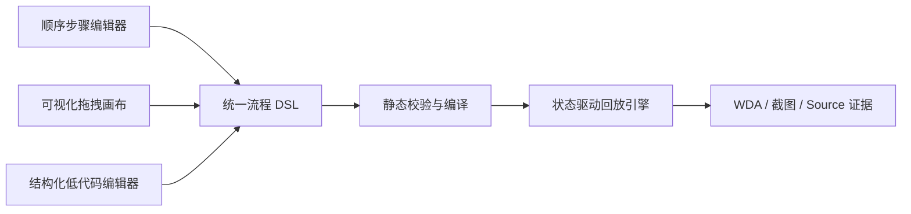
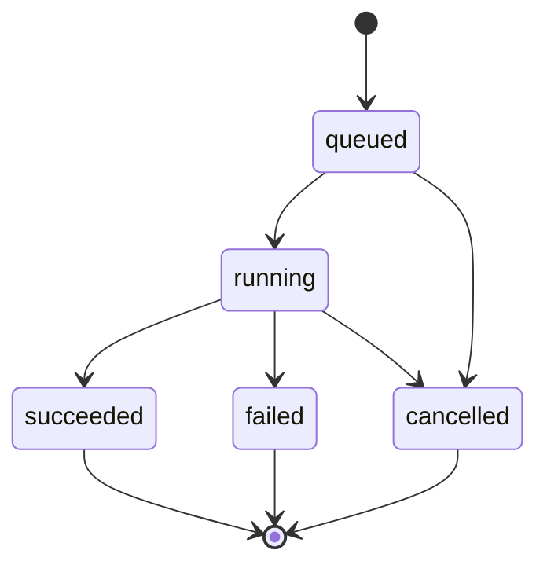

# 真机回放高级编排需求基线

## 文档状态

- 状态：需求边界已确认；流程协议、执行引擎、可视化画布、录制来源确认、持久化草稿和单次组合执行首版已完成，低代码编辑器尚未开始。
- 更新日期：2026-09-04。
- 适用范围：nn-ios-platform 纯黑盒 iOS 真机路径录制与回放。
- 基本原则：不修改 App，不依赖业务探针，以 WDA Source、截图、语义目标和几何坐标作为执行证据。

## 产品定位

高级编排是“纯黑盒、状态驱动的真机流程编排器”，不是通用低代码平台。

产品分为三个使用层级：

1. 普通顺序回放：录制、筛选、补标后按顺序执行。
2. 可视化拖拽编排：使用动作、等待、条件、断言和结束节点组装状态流程。
3. 结构化低代码 DSL：处理拖拽难以表达的复杂条件、变量、受控循环和动态定位。

三个层级共用同一份流程 DSL 和同一个执行引擎。

## 统一架构约束



- DSL 是唯一数据源，画布不另存一套流程语义。
- 可视化编辑和低代码编辑必须可往返切换。
- 无法完整图形化的 DSL 显示为“低代码节点”，不得丢失或静默改写。
- 发布时同时保存原始 DSL 和编译后执行图。

## 当前落地状态

已完成阶段 1 流程协议：

- DSL v1 TypeScript 类型和 JSON Schema。
- Start、Tap、Swipe、Input、Keyboard、Wait、Condition、Assertion 和 End 节点协议。
- 语义 + 几何目标、条件组、变量、受控固定等待、超时、有限重试和证据引用协议。
- 重复 ID、缺失跳转、自由环路、不可达节点、未声明变量、非法条件操作符、坐标/时长/重试范围和纯坐标目标校验。
- DSL 到确定性执行图的编译。
- 旧版顺序录制到 DSL v1 线性流程模板的转换，包含重复输入合并。

当前协议 API：

| 方法 | 路径 | 作用 |
| --- | --- | --- |
| GET | `/api/device-control/replay-flows/schema` | 读取 DSL v1 JSON Schema |
| POST | `/api/device-control/replay-flows/validate` | 校验 DSL，有效时返回编译执行图 |
| GET | `/api/device-control/recordings/:recordingId/replay-flow-template` | 把现有录制转换为 DSL 模板 |

已完成阶段 2 执行引擎代码：

- Start、Action、Wait、Condition、Assertion 和 End 节点状态转移。
- Tap 语义 + 几何双重定位，Input 目标聚焦，Swipe 归一化路径和 Keyboard 白名单指令。
- 参数替换同时覆盖输入文本和目标语义字段。
- 动作超时、有限重试、线性退避、条件轮询、超时/错误分支和人工终止。
- 同一真机仅允许一个活动流程，运行记录不持久化输入值。
- 每个执行节点保留前后 Source、截图、定位策略、条件结果、实际分支和耗时。
- 运行记录和证据可在后端重启后重新读取；重启时未结束运行标记为 `PROCESS_INTERRUPTED`。

当前执行 API：

| 方法 | 路径 | 作用 |
| --- | --- | --- |
| POST | `/api/device-control/replay-flows/runs` | 异步启动 DSL 流程 |
| GET | `/api/device-control/replay-flows/runs/:runId` | 查询运行状态、节点和分支 |
| POST | `/api/device-control/replay-flows/runs/:runId/stop` | 人工终止活动运行 |
| GET | `/api/device-control/replay-flows/runs/:runId/evidence/:evidenceId/:kind` | 读取节点 Source 或截图 |
| POST | `/api/device-control/recordings/:recordingId/replay-flow-runs` | 把现有录制升级为 DSL 并启动执行 |

已完成流程资产与单次组合执行：

- 新建流程必须先确认录制来源，预览录制身份、设备、已选步骤、来源指纹和将生成的 DSL 动作顺序。
- 流程草稿持久化保存并使用 revision 乐观锁；刷新或再次进入编辑器不会从录制隐式重建。
- 编辑器可查看当前录制来源；来源动作变化时只提示，不自动覆盖已编排草稿。
- 用户二次确认后可从原录制重置草稿，保留流程资产 ID、名称和描述，并生成新 revision 与审计事件。
- 新旧来源指纹算法兼容；旧指纹对应的动作内容未变时不会误报来源变化。
- 流程资产可引用一个前置准备流程和一个后置清理流程，引用不复制 DSL 节点。
- 禁止自引用、递归循环、跨项目引用，禁止引用归档或创建中流程。
- 前置失败时跳过主回放，但仍尝试后置清理；主回放失败后也仍执行后置清理。
- 执行任务按阶段保留独立 Run ID、状态、耗时、截图和 Source，只持久化参数名而不保存参数值。
- 回放中心已提供执行链配置、运行参数确认、执行任务列表和分段证据报告。

当前资产与组合执行 API：

| 方法 | 路径 | 作用 |
| --- | --- | --- |
| GET | `/api/device-control/recordings/:recordingId/orchestration-preview` | 确认录制来源、已选步骤、指纹、DSL 模板和诊断 |
| POST | `/api/device-control/recordings/:recordingId/replay-flow-assets` | 从确认录制创建持久化流程草稿 |
| GET | `/api/device-control/replay-flow-assets` | 查询流程资产列表 |
| GET | `/api/device-control/replay-flow-assets/:assetId` | 读取流程资产和当前草稿 |
| GET | `/api/device-control/replay-flow-assets/:assetId/source-preview` | 对比当前草稿记录的来源与最新录制动作 |
| PUT | `/api/device-control/replay-flow-assets/:assetId/draft` | 按 expected revision 保存草稿 |
| POST | `/api/device-control/replay-flow-assets/:assetId/reset-from-recording` | 二次确认后从原录制重置并生成新 revision |
| PUT | `/api/device-control/replay-flow-assets/:assetId/execution-chain` | 保存前置/后置流程引用 |
| POST | `/api/device-control/replay-flow-assets/:assetId/runs` | 启动一次组合回放 |
| GET | `/api/device-control/replay-flow-chain-runs` | 查询单次执行任务 |
| GET | `/api/device-control/replay-flow-chain-runs/:runId` | 查询分段执行报告 |
| POST | `/api/device-control/replay-flow-chain-runs/:runId/stop` | 终止任务并尝试后置清理 |

已完成阶段 3 可视化画布首版：

- 真机操作台在录制停止且至少选中一个可回放步骤后显示“编排流程”入口。
- 从现有录制生成 Start、动作节点、成功结束和失败结束组成的 DSL 画布。
- 支持 Tap、Swipe、Input、Keyboard、Wait、Condition、Assertion 和 End 节点拖入与移动；节点库使用 Pointer Events，统一支持鼠标、触控板和触屏拖放。
- 支持从节点输出端口连接下一节点或条件分支；连线直接修改 DSL 跳转字段，不保存独立边模型。
- 支持目标语义、归一化坐标、滑动路径、键盘指令、基础条件、超时和结束结果配置。
- 支持调用后端静态校验、显示错误与警告、启动/终止真机调试、轮询运行状态和节点状态高亮。
- 支持查看节点执行前后截图、WDA Source、定位策略、条件结果和失败信息。
- 组合 `all`、`any`、`not` 条件首版只做保真展示，不在画布内拆解或静默改写。

关键代码：

- `backend/src/services/DeviceReplayFlow.ts`
- `backend/src/services/DeviceReplayFlow.test.ts`
- `backend/src/services/DeviceReplayFlowExecutionService.ts`
- `backend/src/services/DeviceReplayFlowExecutionService.test.ts`
- `backend/src/services/ReplayFlowAssetService.ts`
- `backend/src/services/ReplayFlowAssetService.test.ts`
- `backend/src/services/ReplayFlowChainExecutionService.ts`
- `backend/src/services/ReplayFlowChainExecutionService.test.ts`
- `backend/src/routes/deviceControl.routes.ts`
- `frontend/src/components/ReplayFlowDesigner.tsx`
- `frontend/src/components/ReplayFlowDesigner.css`
- `frontend/src/pages/DeviceConsolePage.tsx`
- `frontend/src/pages/ReplayCenterPage.tsx`
- `frontend/src/pages/ReplayFlowEditorPage.tsx`
- `frontend/src/services/api.ts`

未落地：

- 不可变发布版本、历史和从版本创建新草稿。
- YAML 低代码编辑器。

当前验证基线：

- 2026-09-04 使用已保存流程资产和参数“王者荣耀”完成真机回放：输入后右上角搜索点击、搜索结果条件等待、结果点击和关注社区连续执行成功，8 个节点全部成功，耗时约 34.4 秒；每个动作和等待节点均生成前后截图与 WDA Source，最终截图显示“关注成功”。
- 2026-09-03 在 USB iPhone 上执行已保存社区搜索组合流程成功，8 个执行节点全部成功，截图和 Source 证据可查看。

- 回放协议专项测试 6 项通过；执行引擎 5 条状态路径和 WDA 启动诊断 2 项测试通过。
- 后端全量 19 个测试套件、132 项测试通过，其中录制来源与流程资产专项测试 11 项通过。
- 前端 1 个测试套件、2 项测试通过。
- 前后端 TypeScript 类型检查和生产构建通过。
- 使用真实录制验证模板迁移，校验结果无错误、无警告。
- 使用逻辑分辨率 `402 × 874` 的 USB iPhone 启动真实 DSL：首节点入口快照相似度 `0.3492 < 0.4`，执行引擎安全转入 Failure End，未误执行后续点击，并保留首节点前后证据。
- 浏览器实际验收通过：入口展示、录制模板加载、节点拖入、节点移动、属性修改、分支连线、重置和后端校验均正常；校验可准确识别缺失 `onTimeout` 和不可达节点，补齐后恢复通过。
- 浏览器实际验收通过：新建流程先进入录制来源确认，正确展示录制身份、设备、来源指纹和 5 条已选动作；已有流程可查看来源预览，旧版兼容指纹正确显示“来源内容一致，指纹算法已升级”，且未触发隐式重置。
- 浏览器发起 WDA 连接时，锁屏设备在约 10 秒内返回“设备已锁定，请解锁后重试 WDA 连接”，快速诊断链路正常。

## 可视化节点范围

### 流程节点

- Start：每个流程只能有一个。
- Success End：成功结束。
- Failure End：失败结束并保留证据。

### 动作节点

第一阶段：

- Tap。
- Swipe。
- Input，支持 `${variable}`。
- Keyboard：Search、Return、Done、隐藏键盘。

后续扩展：

- 系统返回、Home、App 前后台切换。
- App 启动、激活和终止。

### 等待节点

- 等待目标出现或消失。
- 等待目标文本变化。
- 等待页面稳定。
- 等待 Source 与录制快照达到相似阈值。
- 固定时间等待，仅作为最后兜底。

### 条件节点

第一阶段支持：

- 元素存在/不存在。
- 元素可见/不可见。
- 元素启用/禁用。
- 文本等于、包含或不包含指定内容。
- 输入框值是否符合预期。
- 键盘是否显示。
- 页面与指定快照是否相似。
- App 是否处于前台。

条件节点固定输出 `true`、`false`、`timeout` 和 `error`。

### 断言节点

断言只检查状态，不执行动作。失败后可停止、重试或进入失败分支。

## 连线语义

| 节点 | 允许出口 |
| --- | --- |
| Start | next |
| Action | success、failure |
| Wait | success、timeout、error |
| Condition | true、false、timeout、error |
| Assertion | passed、failed、error |
| End | 无 |

第一阶段不允许自由环路。重试通过节点属性或受控 Retry 节点表达，必须设置最大次数和总超时。

## 目标定位模型

目标可以从历史截图/Source 或当前连接真机创建。

每个目标必须同时保存：

- 语义：accessibilityId、name、label、text、type、上下文文本。
- 几何：归一化坐标、控件内相对坐标、录制屏幕尺寸。
- 证据：选取时截图、Source 和元素矩形。

定位顺序：

```text
accessibilityId
→ name/label/text
→ type + 上下文文本
→ 同名元素中选择距录制坐标最近者
→ 归一化坐标兜底
```

允许保存纯坐标节点，但必须显示不稳定警告，不得静默降级。

## 节点执行生命周期

每个动作节点按固定阶段执行：

```text
等待前置条件
→ 语义 + 几何定位目标
→ 执行动作
→ 验证后置条件
→ 选择输出分支
```

每次执行必须记录：

- 实际使用的定位策略。
- 录制坐标和最终执行坐标。
- 匹配到的 WDA 标签和上下文。
- 条件匹配分数和等待耗时。
- 重试次数和最终分支。
- 节点执行前后的截图和 Source。

### 执行状态机



节点运行状态为 `running` / `succeeded` / `failed` / `cancelled`。条件为 false、等待超时或断言失败可以进入显式分支；单节点失败不等于整个流程必然失败，最终结果由到达的 End 节点决定。

### 核心运行错误码

| 错误码 | 含义 |
| --- | --- |
| `RUN_CANCELLED` | 用户主动终止运行 |
| `PROCESS_INTERRUPTED` | 后端重启中断了未完成运行 |
| `NODE_TIMEOUT` | Wait、前置或后置条件未在限时内满足 |
| `ACTION_TIMEOUT` | WDA 动作超过节点时限 |
| `TARGET_NOT_FOUND` | 语义与几何定位都无法确定目标 |
| `WDA_SOURCE_TIMEOUT` | 读取当前 WDA Source 超时 |
| `WINDOW_SIZE_UNAVAILABLE` | 无法把归一化坐标映射到真机尺寸 |
| `SNAPSHOT_SOURCE_UNAVAILABLE` | 快照相似条件无可读取的录制 Source |
| `VARIABLE_MISSING` | 运行时变量未提供 |
| `FLOW_FAILURE_END` | 流程到达 Failure End |
| `TRANSITION_LIMIT` | 跳转次数超过安全上限 |

## 可视化编辑器范围

第一阶段支持：

- 节点库拖入、移动、连线、删除、复制和粘贴。
- 画布缩放、平移、适应屏幕和自动布局。
- 多选、撤销和重做。
- 节点运行状态高亮。
- 从指定节点调试、单步执行、暂停和终止。
- 查看单节点的截图、Source、定位结果和分支证据。

第一阶段不支持：

- 多人实时协同编辑。
- 并行分支。
- 无限循环和递归子流程。
- 跨设备分布式执行。
- 自定义插件节点。

## 低代码 DSL 范围

### 格式与编辑器

- 人工编辑格式优先使用 YAML。
- 提供 JSON Schema 校验、语法高亮、自动补全、格式化和错误行定位。
- 支持画布节点与 DSL 节点双向定位。
- 保存前执行节点引用、分支完整性、变量类型和循环上限校验。

### 允许能力

- AND/OR 条件组。
- 字符串变量和运行上下文读取。
- 元素文本提取。
- 动态目标选择。
- 受限次数循环。
- 可复用子流程调用。
- 白名单内的 WDA 高级动作。
- 运行证据保留策略。

### 安全边界

第一阶段禁止：

- 任意 JavaScript、Python 或 Shell。
- 文件系统读写。
- 任意 HTTP/网络请求。
- 数据库查询和修改。
- 动态安装依赖或加载代码。
- 创建后台线程或无限循环。
- 绕过平台账号、项目和设备权限。

表达式使用受限语法或 CEL 类型引擎，不允许直接执行通用编程语言。

## 变量边界

第一阶段支持字符串变量，例如：

```text
${keyword}
${communityName}
${username}
```

变量来源：

- 执行前人工输入。
- 流程默认值。
- 环境配置。
- 前序节点提取到的元素文本，作为后续扩展。

第一阶段不支持复杂对象、任意表达式脚本和跨流程全局可变状态。

## 版本和发布

- Draft：可编辑、可调试。
- Published：不可直接修改，修改时创建新草稿。
- History：可查看、复制和回滚。
- 每次执行必须绑定具体发布版本。
- 历史报告必须能恢复当时的 DSL、执行图和参数。

## 防止功能碎片化的实施准入规则

高级编排不允许以“页面先加一个节点”或“后端先加一个特殊分支”的方式碎片化迭代。

新增任何节点或语法时，必须同时完成：

1. DSL Schema 与版本兼容定义。
2. 静态校验和可读错误信息。
3. 编译后执行图语义。
4. 执行器实现、超时、重试和终止行为。
5. 可视化画布的节点投影，或明确降级为低代码节点。
6. 低代码编辑器的自动补全和字段说明。
7. 运行日志、截图、Source 和分支证据定义。
8. 单元测试、编译测试和真机验收用例。
9. 本需求文档和用户文档更新。

任何只完成其中一部分的节点都不得进入发布版本。

## 后续实施顺序

当需求解冻后，按以下顺序实施，不直接从拖拽页面开始：

### 阶段 1：流程协议

- DSL v1 Schema。
- 节点、连线、变量、目标和执行结果类型。
- 版本迁移策略。
- 静态校验器。
- DSL 到执行图的编译器。

本阶段不制作拖拽 UI。

### 阶段 2：执行引擎

- Action、Wait、Condition、Assertion 和 End 节点执行。
- 状态转移、超时、受控重试和手动终止。
- 语义 + 几何双重定位。
- 统一证据与调试日志。

本阶段通过 DSL 样例和真机测试，不依赖拖拽 UI。

### 阶段 3：可视化画布

- DSL 执行图的可视化投影。
- 拖放、连线、配置、校验、调试和证据查看。
- 画布操作必须只修改 DSL，不产生隐式状态。

### 阶段 4：低代码编辑器

- YAML 编辑、Schema 提示、错误定位和格式化。
- DSL 与画布双向同步。
- 复杂语法以低代码节点形式保真展示。

### 阶段 5：流程资产化

- Draft、Published 和 History。
- 执行记录绑定发布版本。
- 子流程复用、权限、复制和回滚。
- 与自动质检任务和发布门禁集成。

## 进入后续阶段前必须补齐的设计产物

阶段 1 已完成 DSL、Schema、校验、编译和迁移协议。进入对应后续阶段前，仍需按阶段补齐：

- DSL v1 语法草案和完整样例。
- 节点状态机和错误码。
- 执行证据数据模型。
- 画布信息架构和交互原型。
- 低代码与画布往返兼容规则。
- 旧版顺序录制升级为 DSL 流程的迁移方案。
- 不可视化语法的降级展示方案。
- P0 真机验收用例与失败恢复用例。

## 第一阶段明确不做

- OCR/图像识别作为主定位方式。
- 业务 App 内探针。
- 接口 Mock、数据库修改和网络拦截。
- Monkey 随机探索与固定编排流程混跑。
- 多真机并行分支。
- 跨 App 流程联动。
- 通用脚本、插件市场和无限循环。

## 需求冻结结论

本阶段已确认：

1. 支持可视化拖拽和结构化低代码两种高级编辑方式。
2. DSL 是唯一数据源，两种编辑方式必须可往返。
3. 低代码仅开放受控表达式和白名单 WDA 能力，不开放任意代码。
4. 第一阶段仅支持串行流程、条件分支和有上限重试/循环。
5. 每个节点必须可解释、可调试、可追溯，并保留 WDA Source 和截图证据。
6. 需求基线继续冻结；实施严格按分阶段顺序推进，当前已完成流程协议、执行引擎、可视化画布、录制来源与持久化草稿、单次组合执行的首版闭环。
