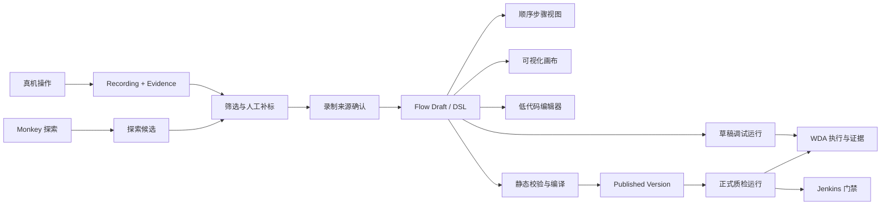

# iOS 黑盒自动化录制与编排设计

**日期：** 2026-09-01

**状态：** 已批准，进入实施计划

**范围：** `nn-ios-platform` 真机黑盒录制、补标、编排、回放与流程资产化

## 1. 背景与问题

平台已经完成纯黑盒录制、人工补标、DSL v1、状态驱动执行引擎和可视化画布首版，能够形成以下技术闭环：

```text
真机操作 → 截图与 WDA Source → 筛选/补标 → DSL → 画布编排 → 真机执行 → 节点证据
```

当前闭环仍存在三个产品化缺口：

1. 编排入口会在没有活动录制时加载最近一次录制，用户无法直观看出默认流程来自哪次录制。
2. 画布编辑结果主要保存在前端内存中，没有 Draft、Published、History 等稳定资产生命周期。
3. 复杂条件缺少低代码编辑能力，流程也尚未正式绑定 P0 用例、自动质检任务和 Jenkins 门禁。

因此，本设计的目标不是重新实现录制和回放，而是把已经存在的技术能力收敛为可追溯、可复用、可发布的自动化测试资产。

## 2. 目标

- 用户完成一次录制后，必须明确选择并确认该录制，才能生成编排初稿。
- 编排初稿必须保存为草稿，关闭页面或重启服务后仍可继续编辑。
- 顺序步骤、可视化画布和结构化低代码编辑器必须共享同一份 DSL。
- 正式自动质检只能执行不可变的发布版本，执行记录必须绑定版本。
- WDA 继续承担确定性控制、页面状态读取和证据采集。
- Monkey 只承担探索，不得替代稳定 P0 回归流程。
- 现有录制、DSL 和运行记录必须保持兼容。

## 3. 非目标

- 不修改被测 App，不要求接入业务探针或埋点 SDK。
- 不提供任意 JavaScript、Shell、Python 等脚本执行能力。
- 不支持无限循环、无上限重试或无边界随机执行。
- 本期不支持并行流程和多设备同步屏障。
- 不让 Monkey 自动发布流程或直接成为发布门禁。
- 不在本期实现跨项目流程市场、收费或外部 SaaS 托管。

## 4. 当前能力基线

已完成能力包括：

- USB iPhone 识别、WDA 启动、连接和常见失败诊断。
- 平台 Tap、Swipe、Input 的精确指令录制。
- 每步操作前后截图、WDA Source 和页面差异证据。
- 手机物理操作产生页面变化候选，并可人工补标为 Tap、Swipe、Input。
- 可回放步骤筛选、噪声排除和目标语义补充。
- DSL v1、JSON Schema、静态校验和确定性执行图编译。
- Start、Tap、Swipe、Input、Keyboard、Wait、Condition、Assertion、End 节点。
- 语义目标与归一化坐标双重定位。
- 状态驱动执行、条件轮询、超时、有限重试、分支和人工终止。
- 节点执行前后截图、Source、定位、条件和分支证据。
- 可视化节点拖放、移动、连线、属性编辑和流程校验。

## 5. 方案选择

### 5.1 方案 A：继续直接从最近录制临时生成画布

优点是改动最小。缺点是来源不透明、编辑会丢失、无法发布和审计，不满足自动质检要求。

### 5.2 方案 B：画布保存独立图模型，执行时再转换为 DSL

优点是前端图形编辑自由度高。缺点是会形成图模型和 DSL 两套事实来源，容易出现连线、条件和版本不一致。

### 5.3 方案 C：录制显式绑定 + DSL 单一事实源 + 流程资产生命周期

这是采用方案。

- 录制负责保存原始操作和证据。
- 草稿负责保存可编辑 DSL。
- 画布和低代码编辑器都是 DSL 的不同投影。
- 发布版本保存原始 DSL 和编译执行图。
- 正式运行绑定发布版本，调试运行可以绑定草稿修订。

该方案与现有架构一致，能够复用已完成的 DSL、校验器和执行引擎。

## 6. 总体架构



## 7. 核心领域模型

### 7.1 Recording

Recording 是不可替代的原始事实来源，包含：

- 录制 ID、名称、所有者、设备、开始和停止时间。
- 平台精确指令步骤。
- 手机页面变化候选。
- 人工补标结果。
- 每步截图、Source 和差异证据。
- 步骤是否进入回放的选择状态。

生成编排时，后端对所有 `ready && included` 的步骤按顺序生成规范化摘要，并计算 `sourceFingerprint`。指纹使用流程生成输入的规范化 JSON 做 SHA-256，不包含截图二进制内容。

### 7.2 Flow Asset

Flow Asset 是稳定的业务身份，至少包含：

- `id`
- `name`
- `projectId`
- `owner`
- `sourceRecordingId`
- `createdAt`
- `updatedAt`
- 当前草稿 ID
- 最新发布版本号

### 7.3 Flow Draft

Flow Draft 是唯一可编辑形态：

- 保存 DSL v1。
- 保存来源录制 ID 和 `sourceFingerprint`。
- 保存当前校验状态。
- 保存最近编辑者和更新时间。
- 支持顺序视图、画布和低代码编辑器往返切换。
- 允许真机调试，但不能直接用于正式质量门禁。

草稿每次成功保存都增加 `revision`。前端使用乐观锁提交 `expectedRevision`；冲突时返回 `409 FLOW_DRAFT_CONFLICT`，不得静默覆盖。

### 7.4 Published Version

发布版本不可修改，包含：

- 流程资产 ID。
- 单调递增版本号。
- 发布时 DSL。
- 编译执行图。
- Schema 版本。
- 来源录制和指纹。
- 发布者、发布时间和发布说明。

任何修改都必须从某个发布版本创建新草稿，再发布为新版本。

### 7.5 Flow Run

Flow Run 分为：

- `debug`：绑定草稿 ID 和 revision。
- `quality`：绑定发布版本 ID。

每次运行都保存设备、App 构建、账号环境、输入参数名称、节点结果和证据。敏感输入值不得持久化。

## 8. 用户流程

### 8.1 录制到编排

1. 用户连接真机并开始录制。
2. 用户执行平台操作或直接操作手机。
3. 用户停止录制。
4. 用户筛选平台步骤和手机变化候选。
5. 用户为候选补标动作和目标。
6. 用户点击“基于本次录制生成编排”。
7. 平台展示录制名称、ID、时间、设备和已选步骤清单。
8. 用户确认后创建 Flow Asset 和 Draft。
9. 平台打开画布，显示 Start、录制动作、Success End 和 Failure End。

平台不得在用户未确认时静默使用“最近一次录制”。

### 8.2 草稿编辑

- 画布修改节点或连线后更新同一份 DSL。
- 低代码编辑器解析成功且通过结构校验后才能写回草稿。
- 无法图形化的合法语法显示为低代码节点，不得丢失。
- 切换编辑模式前必须完成当前内容的解析；有错误时保留原文本并阻止覆盖。
- 草稿自动保存采用 1 秒防抖，关闭抽屉前立即刷新未提交修改。

### 8.3 发布

发布前必须：

- DSL Schema 校验通过。
- 静态流程校验无错误。
- 编译执行图成功。
- 所有必需输入有类型和说明。
- 不存在自由环路、无上限重试或不可达的必需节点。

警告不阻止发布，但必须在确认框中展示。

### 8.4 自动质检

- P0 用例绑定发布流程版本，而不是草稿。
- 质检任务保存 App 构建、设备池、账号、环境和输入参数映射。
- Jenkins 只消费正式质检结果。
- 门禁状态至少包括 `passed`、`failed`、`infra_failed`、`cancelled`。
- `infra_failed` 不得被统计为产品用例失败，但可以按策略阻断发布。

### 8.5 Monkey 探索

- Monkey 根据允许的动作、页面黑白名单、最大步数和最大时长执行探索。
- 每次探索仍通过 WDA 获取 Source 和截图。
- Monkey 行程保存为探索候选，不自动进入已发布流程。
- 用户可以选择一段探索行程，将其送入与普通录制相同的筛选和补标流程。

## 9. 低代码格式

低代码编辑器使用 YAML 表示 DSL，但其数据模型必须保持 JSON 兼容：

- 不允许 YAML 自定义 Tag。
- 不允许锚点和别名改变节点身份。
- 不允许函数、表达式执行或环境变量插值。
- 变量只允许 DSL 定义的 `${NAME}` 占位符。
- 格式化采用稳定字段顺序，避免无意义 diff。
- 解析后的对象必须经过同一 JSON Schema 和静态校验器。

## 10. 错误处理

统一错误码至少包括：

- `RECORDING_SOURCE_REQUIRED`
- `RECORDING_SOURCE_CHANGED`
- `FLOW_DRAFT_CONFLICT`
- `FLOW_DSL_PARSE_ERROR`
- `FLOW_VALIDATION_FAILED`
- `FLOW_PUBLISH_CONFLICT`
- `FLOW_VERSION_REQUIRED`
- `FLOW_RUN_DEVICE_BUSY`
- `FLOW_RUN_INFRA_FAILURE`

错误响应必须包含可读消息；能够定位到 DSL 节点或 YAML 行列时必须返回定位信息。

## 11. 权限与审计

- 测试、研发和管理员可以创建草稿和执行调试。
- 只有具备发布权限的角色可以发布或回滚版本。
- 正式质检执行使用发布版本，不接受请求体直接传入任意 DSL。
- 创建、保存、发布、回滚、删除和执行都记录操作者与时间。
- 输入值、密码、Token 和账号凭证不得写入流程版本或运行日志。

## 12. 测试策略

### 单元测试

- 录制步骤规范化和指纹稳定性。
- 草稿 revision 乐观锁。
- YAML 与 DSL 双向转换。
- 低代码节点保真。
- 发布版本不可变。
- 质量运行必须绑定发布版本。

### 集成测试

- 录制确认后生成草稿。
- 草稿保存、重新打开和冲突处理。
- 画布修改后低代码内容同步，反向修改后画布同步。
- 发布后运行记录绑定精确版本。
- Jenkins 门禁区分用例失败和基础设施失败。

### 真机验收

- 录制、筛选、补标、生成草稿、编辑、调试和证据查看完整串联。
- App 数据变化时通过语义目标和状态条件继续执行。
- 页面状态不满足时安全失败，不执行后续危险动作。
- 发布版本执行结果可恢复当时 DSL、执行图和证据。

## 13. 分阶段交付

### 增量 A：来源明确与草稿持久化

- 移除静默使用最近录制的编排行为。
- 增加录制确认页。
- 增加 Flow Asset、Draft、revision 和自动保存。

### 增量 B：低代码双向编辑

- YAML 编辑、Schema 提示、错误定位和格式化。
- 与画布双向同步。
- 复杂语法低代码节点保真。

### 增量 C：发布、历史与质量门禁

- Published、History、复制和回滚。
- P0 用例绑定发布版本。
- 自动质检和 Jenkins 门禁。

Monkey 探索只在资产化闭环稳定后作为独立后续变更实施。

## 14. 成功标准

- 用户能明确回答当前编排来自哪次录制。
- 已编辑流程关闭页面后不丢失。
- 画布与 YAML 往返后 DSL 语义不变。
- 正式质量运行全部绑定不可变版本。
- 任何历史报告都能恢复当时的 DSL、执行图、设备和证据。
- Monkey 发现的行程必须经过人工筛选才能成为正式流程。
