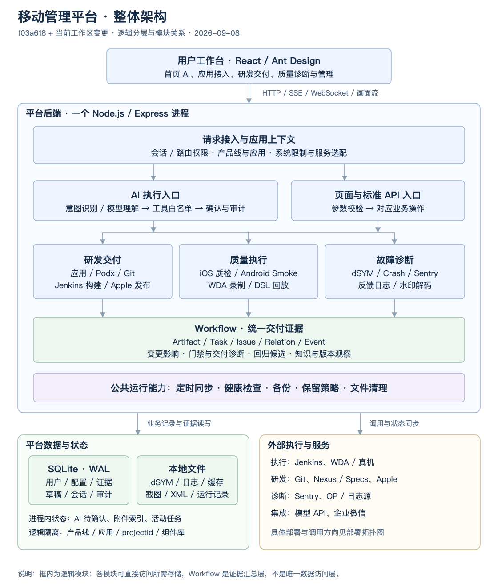
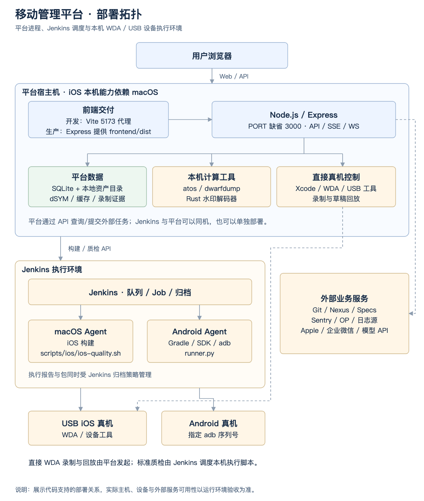
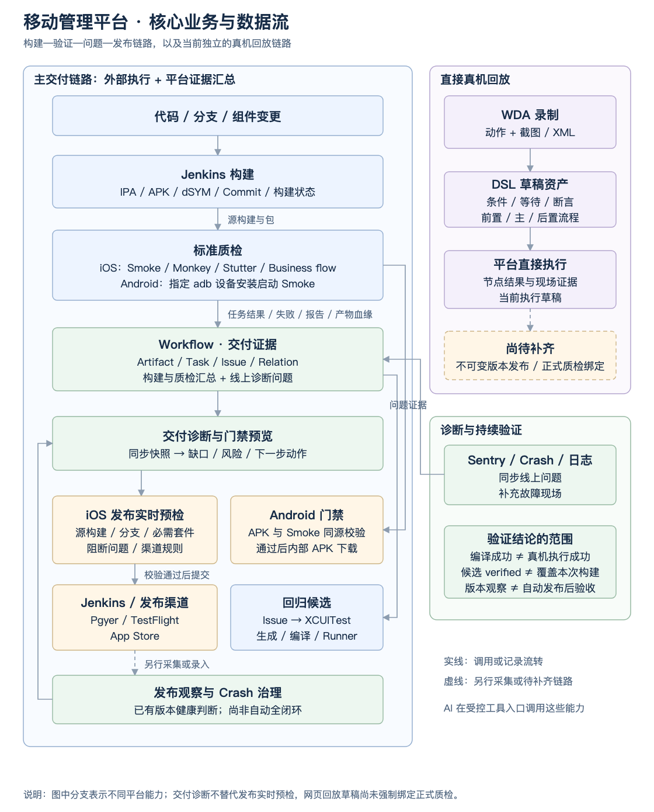

# 移动管理平台整体架构

核对日期：2026-09-08。代码基线：`f03a618`，核对开始时工作区无未提交改动。

本文依据当前前后端入口、服务实现、数据库定义和执行脚本整理。“已实现”表示存在可追踪的代码链路，不代表外部服务、真实产品、设备或生产环境已在本次验收。本文不引用历史数据库统计作为当前运行状态。

功能入口与操作说明见[平台功能文档](平台功能.md)；接入与运维章节见[文档索引](文档索引.md)。历史设计与代码冲突时，本文按当前执行路径描述，并在末尾列出差异。

## 1. 平台定位与系统边界

平台面向多产品线移动研发交付，将应用配置、组件管理、构建发布、真机验证、故障诊断和质量证据集中到一个 Web 工作台。iOS 是当前主要实现；Android 已有应用隔离、APK 构建、指定 adb 设备启动 Smoke 和受门禁控制的内部下载适配。

当前部署形态是 **React 单页应用 + Node.js 模块化单体 + SQLite/本地文件 + 外部执行系统**。后端服务类属于同一 Node.js 进程中的模块，没有独立部署为业务微服务。Jenkins 承担构建和标准质检调度，部分真机录制/回放直接由平台进程调用 WDA 执行。

### 1.1 整体架构图：分层、模块与系统边界

从上到下展示工作台、请求上下文、AI/页面入口、业务模块、交付证据和运行能力，底部区分平台数据与外部系统。业务模块均在同一后端进程内；Workflow 负责证据汇总，各模块仍可直接访问所需存储。



[查看整体架构矢量图](diagrams/platform-overview.svg)。应用/服务隔离详见第 3 节，各业务模块职责详见第 4 节。

### 1.2 部署拓扑图：进程、执行环境与设备

Jenkins 可与平台同机或单独部署，iOS 执行环境依赖 macOS。标准质检由 Jenkins Agent 执行；直接录制/回放通过平台的 WDA 通道操作真机。平台数据使用 SQLite 与本地文件，设备操作由 WDA/USB 通道完成。



[查看部署拓扑矢量图](diagrams/platform-deployment.svg)。数据位置详见第 5 节，启动与运维配置详见第 6 节。该图描述代码支持的部署关系，不代表已探测确认当前所有依赖在线。

### 1.3 核心业务与数据流图：构建、验证、问题与发布

左侧展示构建/质检证据汇总及 iOS 发布决策；Android 下载门禁直接校验 APK 与 Smoke 同源证据，不经过 iOS 交付诊断入口。右侧展示独立的网页回放链路，以及线上诊断向 Workflow 提供问题证据的关系。虚线标出另行采集和待补齐环节。



[查看业务数据流矢量图](diagrams/platform-delivery-flow.svg)。回放当前执行草稿；不可变版本发布及正式质检绑定仍待补齐，详见第 4.3 节。

平台管理的是交付流程与证据。Git 仍保存源代码，Jenkins 仍保存外部任务与归档，Apple/Pgyer 等渠道仍决定实际分发状态；平台提交成功不能直接解释为构建、上架或设备验证成功。

## 2. 代码组织与技术栈

| 层次 | 当前实现 | 主要职责与代码入口 |
| --- | --- | --- |
| 工作区 | npm workspaces：`frontend`、`backend` | [根 package.json](../package.json) 统一开发、构建、检查命令 |
| 前端 | React 18、TypeScript、Ant Design 5、React Router 6、Vite 8、Axios、ECharts | [App.tsx](../frontend/src/App.tsx) 注册页面；[MainLayout.tsx](../frontend/src/layouts/MainLayout.tsx) 处理导航、应用选择和页面准入 |
| 前端数据访问 | 同源 `/api`，Cookie 会话，应用/产品线请求头 | [api.ts](../frontend/src/services/api.ts)；首页 AI 使用流式会话接口 |
| HTTP 后端 | Node.js 22、Express 4、TypeScript | [index.ts](../backend/src/index.ts) 挂载路由、代理、静态文件和后台任务 |
| 业务服务 | `routes` + `services`，部分业务仍直接位于路由文件 | [路由目录](../backend/src/routes)、[服务目录](../backend/src/services)；Jenkins、Sentry、Apple 路由包含较多编排逻辑 |
| 持久化 | `better-sqlite3`，外键开启，WAL 模式 | [connection.ts](../backend/src/database/connection.ts)、[schema.sql](../backend/src/database/schema.sql)、[init.ts](../backend/src/database/init.ts) |
| 本机工具 | Apple `atos`/`dwarfdump`、Xcode、WDA、设备工具、Shell/Python | 符号化与 iOS 真机执行依赖 macOS；Android Runner 使用 Python、Gradle/SDK/adb |
| 水印解码 | Rust 命令行程序 | [watermark-decoder-rs](../backend/tools/watermark-decoder-rs)；后端构建先执行 `cargo build --release` |
| 检查工具 | TypeScript、后端 Jest、前端 Vitest、独立 Playwright 脚本 | [backend/package.json](../backend/package.json)、[frontend/package.json](../frontend/package.json)、[scripts](../scripts) |

前端直接复用后端目录中的纯数据/纯规则模块，例如 `ApplicationServiceCatalog` 和产品线发布权限规则。这是工作区内的源码共享，并非独立 SDK。扩展这些共享文件时应避免引入 Node.js 专属运行时依赖。

## 3. 请求上下文与服务选配

### 3.1 产品线、应用和资源的关系

```text
平台用户 ── 产品线成员关系（角色、商店发布授权）── 产品线
                                                     ├─ iOS 应用
                                                     │    └─ 已选服务及提供商选项
                                                     └─ Android 应用
                                                          └─ 已选服务及执行配置

产品线 ── 共享服务资源配置：Jenkins、Sentry、Podx、Apple 等
iOS 应用/产品线 ── 可绑定同系统共用组件库
```

服务选配决定“可使用哪些模块”；资源配置决定“连接哪套服务”；角色决定“能执行什么动作”。三者分别校验。当前不是所有凭据都已下沉到应用级：同一产品线 iOS/Android 的 Jenkins 服务地址和凭据仍共享，Android 单独配置 Job、包名和设备等参数。

服务目录见 [ApplicationServiceCatalog.ts](../backend/src/services/ApplicationServiceCatalog.ts)：

- Sentry 和 Bugly 都可选作 iOS/Android 的主崩溃提供商，但数据适配程度不同。
- 自动质检要求同时启用 Jenkins 与真机服务。
- Podx、dSYM、日志、API/路由、Workflow、企业微信、水印、Apple 登记、DevOps 当前只声明 iOS 支持。
- 未保存过服务选择的存量应用沿用兼容默认值；显式 `[]` 表示关闭全部可选服务。新应用的初始化规则由应用服务实现处理，不能把兼容默认值理解为所有新应用自动开通。

### 3.2 API 调用路径

1. 前端请求拦截器写入 `X-Product-Line-Id`、`X-Application-Id`，同时携带会话 Cookie。
2. `productLineContextMiddleware` 读取会话、请求头或当前选择 Cookie，验证产品线成员关系、应用归属及启用状态。
3. `runWithProductLine` 使用 `AsyncLocalStorage` 将上下文传递给服务层。
4. `selectedServiceMiddleware` 按 API 前缀检查已选服务；iOS/Android 专属路由再检查应用系统。
5. 路由或服务执行具体权限校验、参数校验及业务操作。

服务层通过 `currentProductLineId()`、`currentApplication()`、`currentProjectId()` 访问当前范围。`currentProjectId()` 优先取当前应用的项目标识。Workflow 路由会用服务端上下文覆盖客户端传入的 `projectId`。

隔离是**共享数据库上的逻辑隔离**，不同数据使用不同键：dSYM/旧业务记录多按 `product_line_id`；Workflow/回放资产按 `project_id`；Android 运行按 `application_id`；组件数据按组件库归属共享。不能概括为每个应用拥有独立数据库或所有数据天然按应用隔离。

源码：[auth.ts](../backend/src/middleware/auth.ts)、[ProductLineContext.ts](../backend/src/services/ProductLineContext.ts)、[ApplicationService.ts](../backend/src/services/ApplicationService.ts)、[ComponentLibraryService.ts](../backend/src/services/ComponentLibraryService.ts)。

## 4. 核心业务模块

### 4.1 Crash、符号与线上治理

本地链路：上传/导入 dSYM → 提取 UUID、架构、版本并建索引 → 解析 `.crash`/`.ips` → 匹配 dSYM → 符号化 → 保存历史 → 可选 AI 分析、下载和企业微信分享。

**当前主符号化实现使用 `atos`**：`.ips` 经格式识别和转换后参与处理，`dwarfdump` 用于 UUID 核对；系统符号服务、缓存和多 dSYM 处理辅助恢复调用栈。仓库仍保留 `symbolicatecrash` 辅助脚本，不能据此将当前主链路描述为调用该工具。操作与排障统一见 [Crash 诊断指南](平台功能.md#crash-diagnostics)。

Sentry 链路包含同源代理、Issue 查询、原始 Crash 获取、符号化/AI 分析和本地 Crash 治理。`CrashGovernanceService` 维护问题聚合、状态、覆盖情况、事件和发布风险信息，并向质量门禁提供证据。Bugly 当前只有应用标识及控制台入口，无对应问题同步/符号还原服务。

源码：[SymbolizerService.ts](../backend/src/services/SymbolizerService.ts)、[DSYMMatcherService.ts](../backend/src/services/DSYMMatcherService.ts)、[sentryAnalysis.routes.ts](../backend/src/routes/sentryAnalysis.routes.ts)、[CrashGovernanceService.ts](../backend/src/services/CrashGovernanceService.ts)。

### 4.2 组件、构建与发布

- 组件服务连接 Podx/CocoaPods、Specs、Nexus、Git，以及 NNRTC/IM SDK 的专用交付源；支持版本查询、导入/发布、替换、依赖检查、dSYM 回填。
- Git 服务负责多仓库分支查询、依赖解析、分支任务预检与流式执行反馈。
- Jenkins 路由聚合分支、构建、日志、失败分析、包体积和符号同步；发布链路记录发布单与阶段事件，执行预检后调用 `JenkinsAssistantService`。
- 发布支持 Pgyer、TestFlight、App Store，Apple 渠道还包含分发/审核状态查询、提审及撤审等适配，依赖各产品线的 Apple 和 Jenkins 配置。
- AI 发布与页面发布复用底层发布服务；AI 受控发布要求源构建并经过两级确认。传统入口是否要求源构建、是否允许风险说明等，以实际渠道及发布预检规则为准，不能由 AI 返回文本决定。

源码：[PodService.ts](../backend/src/services/PodService.ts)、[git.routes.ts](../backend/src/routes/git.routes.ts)、[jenkins.routes.ts](../backend/src/routes/jenkins.routes.ts)、[JenkinsAssistantService.ts](../backend/src/services/JenkinsAssistantService.ts)、[AppStoreConnectService.ts](../backend/src/services/AppStoreConnectService.ts)。

### 4.3 iOS 标准质检与直接真机回放

两条链路共享部分设备基础设施，但调度和记录方式不同：

| 维度 | Jenkins 标准质检 | 平台直接录制/回放 |
| --- | --- | --- |
| 入口 | `/api/jenkins/nn/quality`、`/api/quality/tasks` | `/api/device-control/*` |
| 执行 | Jenkins Job → `scripts/ios/ios-quality.sh` | Node 服务 → `DeviceControlService` → WDA |
| 内容 | Smoke、业务感知 Monkey、卡顿检测、配置型业务流程 | 点按/滑动/输入录制，DSL 条件、等待、断言及前/主/后置流程 |
| 调度状态 | Jenkins 队列/构建 + 本地进度/总结纠偏 | 进程内运行 Map、活动任务约束、Promise 执行 |
| 证据 | Jenkins 归档、本地 `quality-results`、Workflow 记录 | 文件中的录制、运行 JSON、截图、WDA XML；SQLite 中的流程资产/草稿 |
| 中断处理 | 结合 Jenkins 和本地证据判断任务状态 | 历史运行可读取；进程中断的未结束运行标记 `PROCESS_INTERRUPTED`，不自动续跑 |

标准质检通过设备池、UDID、独立 WDA 端口和 DerivedData 避免任务争抢。Monkey 用业务映射选择探索入口；卡顿套件单独采集场景耗时和 xctrace 证据，不能将 Monkey 通过解释为帧级性能通过。`business_flow` 读取配置预设，与网页回放资产不是同一套已发布版本执行链路。

直接回放以 `DeviceReplayFlow.ts` 的 JSON DSL 为事实来源，提供 `start/tap/swipe/input/keyboard/wait/condition/assertion/end` 节点，支持语义定位和坐标兜底、前后条件、超时、有限重试、分支及证据。画布/低代码编辑器通过同一 DSL 表达流程。

当前回放资产支持来源指纹、持久草稿、`expectedRevision` 冲突检查、复制、归档/恢复以及前后置引用的环检测。组合执行逐阶段读取 `asset.draft.flow`，前置失败跳过主流程，后置作为收尾阶段仍会尝试执行。

**版本边界：**数据库定义了 `replay_flow_versions`，资产接口能读取版本列表，但当前服务未实现对应发布写入链路；运行记录不构成完整的不可变版本快照。现阶段不能宣称正式质检已经强制绑定已发布流程版本，或完整重现任意历史 DSL。

源码：[quality.routes.ts](../backend/src/routes/quality.routes.ts)、[ios-quality.sh](../scripts/ios/ios-quality.sh)、[DeviceRecordingService.ts](../backend/src/services/DeviceRecordingService.ts)、[DeviceReplayFlow.ts](../backend/src/services/DeviceReplayFlow.ts)、[ReplayFlowAssetService.ts](../backend/src/services/ReplayFlowAssetService.ts)、[ReplayFlowChainExecutionService.ts](../backend/src/services/ReplayFlowChainExecutionService.ts)。

### 4.4 Workflow 与交付证据

`WorkflowService` 提供统一的 Artifact、Task、Issue、Relation、Event 模型；`WorkflowIntegrationService` 将 Jenkins、Sentry、反馈日志、dSYM、组件等信息映射到这些实体。质量任务和 Android 交付也会写入统一任务/证据模型。

实体关系是“关联图”，不是所有业务都已保证完整的一条强事务链。例如：构建关联 IPA/dSYM，质量任务关联源构建，失败产生 Issue，Issue 可生成回归候选；门禁关联构建和问题，发布观察关联版本。

`QualityGateService` 提供不落库的预览和持久化评估，结合构建状态、必需套件、执行时间、Commit/分支、失败/Crash 计数、阻断 Issue、性能基线和线上 Crash 治理判断。`ReleaseGatePolicy` 解析 Jenkins 发布使用的必需套件配置。正式发布仍需要实时预检，Workflow 快照不能代替它。

`DeliveryReadinessService` 按源构建号汇总六个阶段：变更与产物、构建、质量验证、问题处理、回归闭环、发布观察；返回证据、缺口、优先级和处理入口。单类证据超过 500 条会标记不完整；没有发布观察时，未发现其他已知风险也只能返回未知，不能据此证明版本健康。

回归候选可生成、导出、编译验证和提交 XCUITest Runner；生成成功、编译成功、执行成功、覆盖本次构建是不同证据层级。知识沉淀、AI 评测记录和发布观察接口已经存在，但本次未验证真实团队闭环使用。

源码：[WorkflowService.ts](../backend/src/services/WorkflowService.ts)、[WorkflowIntegrationService.ts](../backend/src/services/WorkflowIntegrationService.ts)、[QualityGateService.ts](../backend/src/services/QualityGateService.ts)、[ReleaseGatePolicy.ts](../backend/src/services/ReleaseGatePolicy.ts)、[DeliveryReadinessService.ts](../backend/src/services/DeliveryReadinessService.ts)、[XCUITestWorkflowService.ts](../backend/src/services/XCUITestWorkflowService.ts)。

### 4.5 Android 交付适配

Android 使用独立的 `AndroidDeliveryService` 和 `/api/android`，不会复用 iOS 专属 Jenkins/质检路由。

1. 创建构建时指定完整 40 位 Commit、稳定请求键和应用配置。
2. 平台先保存运行记录，再提交 Jenkins；提交响应不明确时保留 `dispatch_unknown`，通过原请求标识追踪，避免盲目重复提交。
3. Build Pipeline 固定检出 Commit，Runner 构建 APK 并输出 `mobile-delivery.json`，记录包名、版本和 SHA-256 等证据。
4. Smoke 绑定同一来源运行，复制指定构建 APK，在锁定的 adb 设备上校验、安装和启动，输出 `mobile-quality.json`、日志和截图。
5. 平台校验证据后汇总 Issue、门禁和内部下载条件。问题解决需要关联验证运行。

当前不包含 AAB、应用商店发布、R8/NDK 符号、业务回归和性能专项；`readiness()` 明确返回 `pending_external_validation`。仅配置齐全不能改写为真实产品接入验收成功。

源码：[AndroidDeliveryService.ts](../backend/src/services/AndroidDeliveryService.ts)、[Android Pipeline 与 Runner](../scripts/android)、[Android 接入说明](部署与运行.md#android-runner)。

### 4.6 AI 执行与诊断

```text
首页输入 → 可用工具筛选 → 确定性意图匹配 / 模型理解
                                  │
                                  ▼
                    Schema 校验与角色/应用/服务检查
                                  │
                       直接查询 / 展示待确认动作
                                  │
                    再次检查可执行性 → 调用业务服务
                                  │
                       审计、脱敏结果、SSE 页面更新
```

`AssistantModelGateway` 优先处理可确定匹配的意图，再调用配置的模型接口；支持 Responses 与 Chat Completions 两种协议。`AssistantToolRegistry` 定义具名工具、角色、系统/服务条件、参数 Schema、风险级别、确认次数、超时与部分操作的幂等策略。

读工具通常不需要确认，普通执行操作一次确认，发布/停止等高风险工具两次确认。这里是工具注册的风险分级，不能推导为每个 `read` 工具完全没有本地写入，例如状态同步可能刷新本地记录。

`AssistantService` 限制连续工具调用为 8 轮；待确认动作在内存中保存 15 分钟，审计写 SQLite。最终确认时输入的发布验证密码直达服务，不进入模型上下文。附件仅支持 `.crash/.ips/.txt`，接口限制 10 MiB，索引保存在内存，文件位于系统临时目录；15 分钟过期检查在注册/访问附件时触发，不是独立定时器保证准点删除。

首页完整会话保存在 React 页面状态，刷新后清空；但工具审计和业务语义分析日志会持久化。因此“页面不保存完整聊天历史”不能表述为服务端不记录任何用户输入或分析信息。

源码：[AssistantModelGateway.ts](../backend/src/services/AssistantModelGateway.ts)、[AssistantToolRegistry.ts](../backend/src/services/AssistantToolRegistry.ts)、[AssistantService.ts](../backend/src/services/AssistantService.ts)、[assistant.routes.ts](../backend/src/routes/assistant.routes.ts)、[BusinessSemanticService.ts](../backend/src/services/BusinessSemanticService.ts)。

## 5. 数据、文件与生命周期

### 5.1 SQLite 数据分组

| 数据域 | 主要表 |
| --- | --- |
| 用户与配置 | `platform_users`、`platform_sessions`、`platform_product_lines`、`platform_product_line_memberships`、`platform_applications`、`platform_product_line_configs`、`platform_config`、`platform_user_registration_requests` |
| 组件 | `component_libraries`、`pods_components` |
| Crash | `dsym_info`、`symbolication_history`、`sentry_issue_symbolication_history`、`crash_governance_records/config/events/notifications`（后四项均带 `crash_governance_` 前缀） |
| 交付证据 | `workflow_artifacts/tasks/issues/relations/events`（均带 `workflow_` 前缀） |
| 门禁与持续验证 | `workflow_quality_baselines`、`workflow_release_gates`、`workflow_regression_candidates`、`workflow_knowledge_entries`、`workflow_ai_evaluations`、`workflow_release_observations` |
| 回放资产 | `replay_flow_assets`、`replay_flow_drafts`、`replay_flow_versions`、`replay_flow_audit_events`；版本表存在不代表发布链路完成 |
| Android | `android_delivery_runs` |
| 日志与辅助查询 | `realtime_log_pairing_sessions`、`user_query_records`、`api_doc_view_records`、`api_request_samples`、`api_request_invalid_tokens` |
| Apple 与平台统计 | `apple_developer_devices`、`apple_device_registration_requests`、`service_access_stats`、`assistant_action_audits` |

建表不只发生于 `schema.sql`：数据库初始化包含增量迁移，部分路由/服务自行建表。因此只阅读基础 SQL 会遗漏 Crash 治理、组件、Apple 登记和查询统计等数据结构。

### 5.2 文件与内存状态

| 位置/配置 | 内容 | 生命周期边界 |
| --- | --- | --- |
| `DB_PATH` | SQLite 主库 | 在线备份通过 SQLite API 生成 |
| `DATA_DIR` 及产品线子目录 | 设备池、Jenkins 发布单/缓存、业务配置、API 缓存等 | 具体按各服务的路径函数解析 |
| `UPLOAD_DIR`、`DSYM_DIR` | 上传中间文件与长期符号文件 | 上传清理与 dSYM 保留策略分开 |
| `DEVICE_RECORDING_DIR` | 录制 JSON、截图、WDA source | 与数据库草稿共同构成回放来源 |
| `DEVICE_REPLAY_RUN_DIR`、`REPLAY_FLOW_CHAIN_RUN_DIR` | 单流程和组合运行记录、执行证据 | 历史可读取；运行记录未完整保存 DSL 与输入值 |
| Jenkins workspace/archive | 包、质检 summary/result/issues/report、Crash、Trace | 生命周期也受 Jenkins 归档/清理配置影响 |
| 能力数据集、语义日志目录 | 工具/入口能力索引、检索未命中与意图解析 JSONL | 当前为文件型检索/统计，不是独立向量数据库 |
| 进程内 Map | 待确认 AI 动作、附件索引、同步状态、设备/回放活动状态等 | 服务重启后不具有通用恢复/续跑能力 |

路径默认值存在历史差异：数据库默认相对仓库根定位；多处 `DATA_DIR`/录制目录相对 `process.cwd()` 的上一级定位；上传服务还有自己的相对路径默认值。部署时应明确配置绝对路径，不能仅凭目录名认定所有文件都在同一个数据目录。

数据库备份**不包含** dSYM、截图、Trace、发布单 JSON、Jenkins 归档；完整迁移/恢复需要同时覆盖这些资产。

## 6. 运行、部署与运维

| 项目 | 代码默认值/行为 | 依据 |
| --- | --- | --- |
| Node 运行时 | `.node-version`、`.nvmrc` 固定 `22.22.3`；统一 npm 包装器选择 Node 22 | [run-with-supported-node.mjs](../scripts/run-with-supported-node.mjs) |
| 后端监听 | `PORT`，缺省 `3000`，监听 `0.0.0.0` | [index.ts](../backend/src/index.ts) |
| 前端开发 | Vite 5173；优先显式后端目标，否则探测 3000/3001 | [vite.config.ts](../frontend/vite.config.ts) |
| 生产静态资源 | 存在 `frontend/dist` 时，Express 提供静态资源与 SPA fallback | 同后端入口；可按环境增加反向代理 |
| 环境配置 | 查找 `backend/.env` 等候选文件并以 `override: true` 加载 | [env.ts](../backend/src/config/env.ts)；不能假定启动命令的同名变量总能覆盖文件 |
| 业务同步 | 默认启动 15 秒后首轮，之后每 10 分钟 | `WORKFLOW_SYNC_ENABLED`、`WORKFLOW_SYNC_INTERVAL_MINUTES` |
| 数据库备份 | 默认每 24 小时 | `WORKFLOW_BACKUP_ENABLED`、`WORKFLOW_BACKUP_INTERVAL_HOURS`、`WORKFLOW_BACKUP_DIR` |
| WAL checkpoint | 默认每 6 小时 | `WORKFLOW_WAL_CHECKPOINT_HOURS` |
| 上传清理 | 启动时执行，默认每小时，文件默认保留 24 小时 | `CLEANUP_INTERVAL_HOURS`、`CLEANUP_MAX_AGE_HOURS` |
| 长期保留策略 | 默认预览；删除另需配置开关与确认参数 | `WORKFLOW_RETENTION_ALLOW_DELETE` 与 `applyRetention()` |

同步由 `PlatformOperationsService` 在同一 Node 进程中运行，通过内部 HTTP 请求复用已有数据同步入口，按产品线记录成功/失败/数量/耗时，跳过关闭的服务。当前这套周期同步选择产品线的 iOS 应用；Android 运行通过独立同步接口刷新，不能认为 Android 已自动纳入五类周期同步。

健康检查分层：

- `/health/live`：进程存活、PID、运行时间。
- `/health/ready` 和 `/health`：SQLite 查询与数据库文件可访问性。
- `/api/health/dependencies`：外部依赖探测汇总，部分状态异常可返回 HTTP 207。

`ready` 并不证明 Jenkins、真机或所有第三方服务可用。同步状态和定时器也不是独立持久化任务队列；当前未建立跨实例调度锁或通用故障续跑机制，多实例部署需要进一步设计共享状态和执行互斥。

宿主 Mac 配置 WDA、USB 配对与 Xcode；Jenkins Agent 使用本机质检脚本，平台也可通过 WDA 直接录制和回放。

运行入口：[start-platform.sh](../start-platform.sh)、[package.json](../package.json)、[PlatformOperationsService.ts](../backend/src/services/PlatformOperationsService.ts)、[iOS 真机部署](部署与运行.md#ios-quality-setup)。

## 7. 权限与审计的当前边界

平台支持 `guest/tester/developer/product/admin`，产品线成员可拥有不同角色；研发的 App Store 发布权限可按用户和产品线单独授予。角色不是简单线性继承，例如产品运营不因此获得研发/测试能力。

实名账户采用 scrypt 密码哈希，Cookie 会话在数据库中保存 Token 哈希。AI 工具包含独立角色和服务范围校验、同源请求检查、参数白名单、动作确认及脱敏审计。

当前同时保留三类访问机制：

1. 实名会话与 `sessionAuthMiddleware`。
2. 旧 `AUTH_ENABLED/AUTH_PASSWORD/ADMIN_PASSWORD` 认证兼容路径；部分中间件在关闭认证或缺少对应密码时放行。
3. 平台内部同步 Token、日志配对 Token、Apple 登记回调等专用访问路径。

因此不能声明“所有 API 写入都必须实名管理员授权”。例如 Workflow 的部分写接口未逐条挂载角色中间件，而前端质量中心及 AI 的对应工具限制更严格。菜单权限、服务选配、产品线隔离和后端动作权限应分开理解。

入口代理还包括 `/sentry` 及兼容路径、`/op`/`/jeecg-boot`/`/sys`。代理放在 body parser 前以保留原请求，Apple 描述文件回调也采用独立原始请求体处理。API 的 JSON 返回约定不适用于这些代理、文件下载、SSE 和 WebSocket。

## 8. 与既有说明的差异及后续维护点

| 主题 | 本次按代码确认的结论 |
| --- | --- |
| 平台规模 | 已超出 Crash 工具；当前业务后端仍为单体，Jenkins 承担外部调度 |
| 符号化工具 | 主执行路径是 `atos`；旧使用文档已合并清理，部分路由日志仍写 `symbolicatecrash` |
| 流程版本 | 草稿与运行成立，版本表已定义；缺少版本发布写入和正式质量任务强制绑定链路 |
| Android/Bugly | Android 首期代码适配待真实外部验收；Bugly 只有控制台入口 |
| 权限 | 新旧机制并存，前端/AI 更严格的限制不能替代旧 API 权限治理 |
| 会话与附件 | 页面会话不持久化完整历史，但审计/语义日志有记录；附件过期为访问时清理 |
| 运行默认值 | Node 22.22.3；后端缺省 3000。旧 Node 26 说明已清理，部署参数统一见部署指南 |
| 交付闭环 | 证据模型、规则和操作入口存在；回归 verified 与版本观察尚不能自动证明本次构建完成闭环 |

后续扩展应优先维护：应用/产品线隔离契约、统一权限入口、不可变回放版本、执行证据到构建的绑定，以及文件/数据库/外部归档的一致恢复策略。详细目标与验收见[设计与演进](设计与演进.md#platform-evolution)，当前实现和待完成事项分别维护。

## 9. 文档核验范围

本次静态核对前后端路由、核心服务、数据库定义与迁移、npm 启动/构建命令、Jenkins/iOS/Android 执行脚本，并检查本文的仓库文件链接。三张架构图提供 SVG 源图与 PNG 预览，已渲染检查文字和连线。未启动平台，未查询生产数据库，未调用外部模型、Jenkins、Apple、Sentry、Bugly 或真机，也未重新运行全量测试；本文不是外部系统验收报告。
