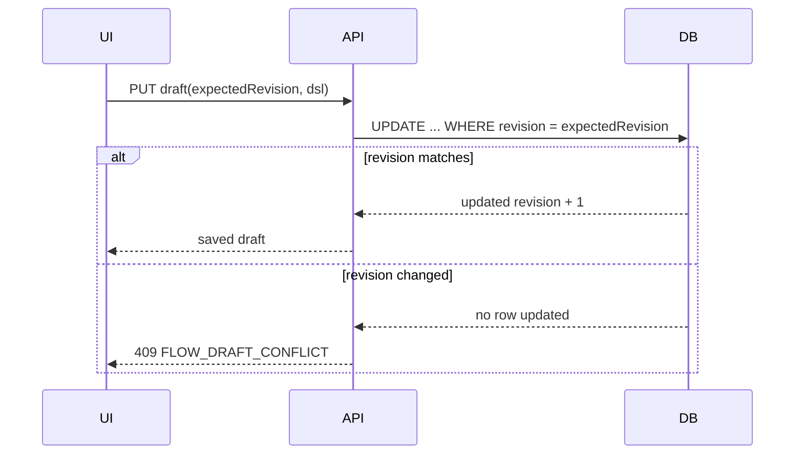

# Design: Formalize Recording Orchestration

## Context

当前录制数据保存在文件系统，流程模板按请求临时生成，可视化画布以内存 DSL 工作。后端已经具有 DSL 校验、编译、执行和运行证据持久化，因此本变更将资产生命周期作为独立层加入，而不重写执行引擎。

完整设计依据：

- `docs/superpowers/specs/2026-09-01-ios-black-box-recording-orchestration-design.md`

## Decisions

### Decision 1: DSL remains the single source of truth

顺序步骤视图、画布和 YAML 编辑器都读写同一 DSL。画布连线继续直接修改节点跳转字段，不增加独立 edges 表。

### Decision 2: Explicit recording confirmation replaces implicit latest-recording orchestration

设备操作台仍可展示最近一次录制，但编排生成必须显式提交 `recordingId` 和生成确认信息。前端必须展示录制 ID、停止时间、设备和已选步骤数。

### Decision 3: Drafts use optimistic concurrency

每个 Flow Draft 包含单调递增 `revision`。保存请求携带 `expectedRevision`。不匹配时后端返回 `409 FLOW_DRAFT_CONFLICT` 和当前 revision，客户端提供重新加载或复制为新草稿，不执行自动覆盖。

### Decision 4: Source fingerprints detect recording drift

后端对参与模板生成的步骤规范化后计算 SHA-256：

```text
recordingId + ordered ready/included step IDs + action payload + target payload
```

截图和 Source 文件内容不进入指纹。录制选择或补标发生变化后，重新生成得到不同指纹。打开旧草稿时平台提示来源已变化，但不自动改写草稿。

### Decision 5: Publishing creates an immutable snapshot

发布事务包含：

1. 校验 DSL。
2. 编译执行图。
3. 分配下一版本号。
4. 保存 DSL、执行图、来源指纹和发布元数据。

任何步骤失败都不得产生部分版本。

### Decision 6: Formal quality runs accept version IDs only

草稿调试运行允许提交 `draftId + revision`。正式质量运行只接受 `flowVersionId`，服务端加载已发布 DSL 和执行图，不接受调用方覆盖 DSL。

### Decision 7: YAML is a safe serialization format, not a scripting language

YAML 只允许 JSON 兼容标量、对象和数组。禁用自定义 Tag、可执行表达式、环境变量、锚点和别名。解析后统一执行 JSON Schema 和静态流程校验。

## Data Model

### replay_flow_assets

| Field | Purpose |
| --- | --- |
| id | Flow Asset identity |
| project_id | Project scope |
| name | User-facing name |
| owner | Creator |
| source_recording_id | Initial recording |
| current_draft_id | Active draft |
| latest_version | Last published number |
| created_at / updated_at | Audit timestamps |

### replay_flow_drafts

| Field | Purpose |
| --- | --- |
| id | Draft identity |
| flow_id | Parent asset |
| revision | Optimistic-lock revision |
| schema_version | DSL schema version |
| dsl_json | Canonical DSL |
| source_recording_id | Source recording |
| source_fingerprint | Generation fingerprint |
| validation_json | Last validation summary |
| updated_by / updated_at | Audit |

### replay_flow_versions

| Field | Purpose |
| --- | --- |
| id | Immutable version identity |
| flow_id | Parent asset |
| version | Monotonic number |
| schema_version | DSL schema version |
| dsl_json | Published DSL |
| compiled_graph_json | Published execution graph |
| source_recording_id | Source recording |
| source_fingerprint | Source fingerprint |
| release_note | Publish note |
| published_by / published_at | Audit |

### replay_flow_audit_events

记录 create、save、publish、rollback、copy、delete、debug_run 和 quality_run。事件 metadata 不允许包含真实输入值或凭证。

## API Shape

### Recording confirmation

- `GET /api/device-control/recordings/:recordingId/orchestration-preview`
  - 返回录制身份、已选步骤摘要、指纹和模板校验结果。
- `POST /api/device-control/recordings/:recordingId/flow-drafts`
  - 明确确认后创建 Flow Asset 和 Draft。

### Drafts

- `GET /api/device-control/replay-flow-drafts/:draftId`
- `PUT /api/device-control/replay-flow-drafts/:draftId`
- `POST /api/device-control/replay-flow-drafts/:draftId/validate`
- `POST /api/device-control/replay-flow-drafts/:draftId/debug-runs`
- `POST /api/device-control/replay-flow-drafts/:draftId/reset-from-recording`

### Versions

- `POST /api/device-control/replay-flow-drafts/:draftId/publish`
- `GET /api/device-control/replay-flows/:flowId/versions`
- `GET /api/device-control/replay-flow-versions/:versionId`
- `POST /api/device-control/replay-flow-versions/:versionId/create-draft`

### Quality runs

- 质量任务新增 `flowVersionId`。
- 正式执行由后端通过 version ID 加载流程。

## Frontend Components

- `RecordingOrchestrationPreview`：录制来源和步骤确认。
- `ReplayFlowWorkspace`：草稿加载、保存状态和编辑模式切换。
- `ReplayFlowDesigner`：继续承担画布投影。
- `ReplayFlowCodeEditor`：YAML、格式化、错误行列和 Schema 提示。
- `ReplayFlowVersionPanel`：发布、历史、复制和回滚。

`DeviceConsolePage` 不再直接把当前 `recording` 传入设计器生成临时模板，而是先创建或选择持久化 Draft。

## Save and Conflict Flow



## Migration

- 新表通过 SQLite schema migration 创建。
- 现有录制不主动批量转换，用户首次点击生成时创建 Flow Asset。
- 现有临时运行记录保留，读取时显示 `legacy` 来源。
- 现有 DSL v1 不做破坏性字段变更。

## Failure Handling

- 来源录制不存在或无权访问：`404 RECORDING_NOT_FOUND` 或 `403 FORBIDDEN`。
- 录制没有 ready/included 步骤：`409 RECORDING_HAS_NO_SELECTED_STEPS`。
- 来源指纹变化：预览展示差异；重置操作要求二次确认。
- YAML 解析失败：保留编辑文本，返回行列，不覆盖 DSL。
- 发布校验失败：不创建版本，返回节点级 diagnostics。
- 正式运行缺少版本：`400 FLOW_VERSION_REQUIRED`。

## Security

- 所有 Asset、Draft、Version API 使用实名会话和角色权限。
- 正式执行不允许请求体提交任意 DSL。
- YAML 解析器使用安全 schema。
- 审计 metadata 对 input、password、token、secret 字段执行拒绝或脱敏。

## Test Strategy

- Service 单元测试覆盖指纹、revision、发布事务和版本不可变。
- Route 集成测试覆盖权限、冲突和错误码。
- Frontend 测试覆盖来源确认、自动保存、冲突、模式切换和解析错误。
- 真机验收覆盖录制到发布版本执行的纵向闭环。
